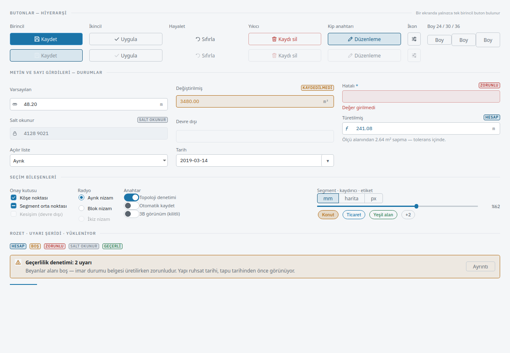

# Bileşenler

KentOSCad'in pencerelerinde karşınıza çıkan düğme, girdi kutusu, onay kutusu, anahtar
ve etiketleri tanımak isteyen kullanıcı için; bu sayfayı bitirdiğinizde bir denetimin
görünüşünden ne yaptığını, hangi durumda olduğunu ve klavyeyle nasıl kullanılacağını
okuyabileceksiniz.

KentOSCad'in her penceresi aynı bileşen setinden kurulur. Proje Ayarları'ndaki bir
düğme ile Veritabanı penceresindeki bir düğme aynı boyda, aynı köşe yuvarlağında ve
aynı renklerde çizilir; bir pencerede öğrendiğiniz kural hepsinde geçerlidir.



## Ortak kurallar

- **Üç boy vardır:** 24, 30 ve 36 piksel. Formlarda ve iletişim pencerelerinde
  denetimler 30 piksel yüksekliğindedir; araç çubuğu ve satır içi eylemler 24, vurgulu
  eylemler 36.
- **Köşe yarıçapı 4 piksel**, kenar çizgisi tema renginden gelir. Köşesi tam yuvarlak
  olan tek şey çiplerdir.
- **Bir ekranda tek birincil düğme bulunur.** Mavi dolgulu düğme o pencerenin "asıl
  cevabı"dır: `Tamam`, `Bağlan`, `Filtrele`, `Seç`. Geri kalan her eylem ikincil,
  hayalet ya da yıkıcıdır.
- **Durum hiçbir zaman yalnız renkle söylenmez.** Hatalı bir girdi kırmızı kenara ek
  olarak ünlem işareti taşır; türetilmiş bir değerin başında `fx` vardır; kapalı bir
  anahtarın topuzu solda durur. Renkleri ayırt etmeyen bir kullanıcı da her durumu
  okur.
- **Klavye halkası yalnızca klavyeyle gelir.** Bir denetime Tab ile ulaştığınızda
  çevresinde iki piksellik mavi halka görünür; fareyle tıkladığınızda görünmez. Halka
  "klavye şu an burada" demektir.

## Düğmeler

Altı rol vardır. Rol, düğmenin ne kadar önemli olduğunu ve ne yapacağını söyler:

| Rol | Görünüş | Ne zaman | Örnek |
|---|---|---|---|
| **Birincil** | mavi dolgu, beyaz yazı, çoğunlukla simgeli | pencerenin asıl onayı; ekranda bir tane | `Tamam`, `Bağlan`, `Filtrele` |
| **İkincil** | koyu zemin, ince kenar | yıkıcı olmayan diğer eylemler | `İptal`, `Uygula`, `Gözat…`, `Düzenle…` |
| **Hayalet** | zemin yok, kenar yok, yalnız yazı | düşük öncelikli eylem | `Yardım`, `Tümü`, `Hiçbiri`, `Yenile` |
| **Yıkıcı** | kırmızı kenar ve yazı, çöp kutusu simgesi | geri alınamayan eylem; her zaman onay ister | `Sil`, `Projeyi Sil` |
| **Kip anahtarı** | basılıyken mavi kenar ve dolgu | açık/kapalı bir durumu taşır | `Düzenleme` |
| **Simge düğmesi** | 32×32 piksel kare, yalnız simge | yeri dar araç eylemleri; adını ipucu söyler | dişli, ayar simgesi |

Menü açan bir düğmenin sağında küçük bir ok vardır; ok yazıya yazılmaz, düğme çizer.
Katman Özellikleri penceresindeki `Stil` düğmesi böyledir.

**Klavye:** Tab ile düğmeye gidin, **Space** ya da **Enter** ile basın. Pencerenin
varsayılan düğmesi — çoğunlukla birincil olan — nerede olursanız olun **Enter** ile
çalışır; **Esc** her pencerede `İptal` ya da `Kapat` demektir. Menülü düğmede
**Space** menüyü açar, ok tuşları menüde gezer.

## Girdiler

Metin ve sayı kutuları yedi durumdan birindedir. Durum kutunun kenarında, başındaki
işarette ve varsa etiketinin yanındaki rozette okunur:

| Durum | Kenar | İşaret | Anlamı |
|---|---|---|---|
| **Varsayılan** | ince gri | alanın türüne göre: cetvel, takvim | değer olduğu gibi duruyor |
| **Odaklı** | mavi, iki piksel | — | yazdığınız buraya gider |
| **Değiştirilmiş** | turuncu, hafif turuncu zemin | `KAYDEDİLMEDİ` rozeti | değeri siz değiştirdiniz, henüz kaydedilmedi |
| **Hatalı** | kırmızı | ünlem, `ZORUNLU` rozeti | değer kabul edilmiyor ya da zorunlu alan boş |
| **Salt okunur** | gri, koyu zemin | kilit | okunur, yazılamaz |
| **Devre dışı** | soluk | — | bu bağlamda anlamı yok |
| **Türetilmiş** | mavi, hafif mavi zemin | `fx`, `HESAP` rozeti | programın hesapladığı değer; elle girilmez |

Sayılar tek aralıklı yazı tipiyle yazılır. Kutuya sayıyı boşluksuz yazarsınız
(`3480.00`); tablo ve nesne denetçisi gösterirken binlikleri boşlukla ayırır
(`3 480.00`). Uzunluk ve alan kutularının sağ kenarında birim soluk yazıyla durur:
`m`, `m²`, `°`. Kutuya birim yazmazsınız; yalnız sayıyı yazarsınız.

Sayı kutusu yalnız o alanın izin verdiği karakterleri kabul eder: tam sayı alanına
virgül yazılamaz, ondalık alan tanımlanan basamak kadar ondalık alır, tarih alanı
`YYYY-AA-GG` biçiminde okur ve gösterir: `2019-03-14`.

**Açılır liste** aynı kutunun içinde bir değer ve sağda aşağı bakan bir ok taşır;
ok "bu açılır" demektir. Liste açılınca seçenekler 26 piksellik satırlarda, panel
zemininde sıralanır; üzerine gelinen satır hafif boyanır. Kutunun kenarı metin
kutusuyla aynı durumları söyler: odaklanınca mavi, değiştirilince turuncu, devre
dışıysa soluk. Program boyunca — Seçenekler, stil tasarımcısı, sütun formu — aynı
liste kullanılır; başka görünüşte bir açılır liste görürseniz bu bir hatadır.

**Değiştirilmiş ile Hatalı farklı şeyler söyler.** Turuncu "bunu siz değiştirdiniz ve
kaydedilmedi", kırmızı "bu değer kabul edilmez" demektir. Turuncu bir kutuyu
kaydetmek yeter; kırmızı bir kutu düzeltilmeden pencere kapanmaz.

**Klavye:**

- **Enter** girişi onaylar. Öznitelik tablosunda ve nesne denetçisinde onaylanan
  girişten sonra imleç bir sonraki alana geçer ve onu düzenlemeye açar; son
  sütundaysanız sonraki satırın ilk sütununa iner.
- **Esc** girişi iptal eder, eski değer geri gelir.
- **Tab** onaylayıp sonraki denetime gider.
- Açılır listede **Alt+↓** ya da **Space** listeyi açar; bir harf yazmak o harfle
  başlayan seçeneğe gider.
- Tarih alanında **Alt+↓** ya da **F4** takvimi açar; çok seçimli alanda aynı tuşlar
  listeyi açar. Takvimde ok tuşları gün gün, **PgUp / PgDn** ay ay yürür; **Home**
  bugüne gider, **Enter** seçer, **Delete** alanı boşaltır, **Esc** kapatır.

Girdilerin öznitelik tablosunda nasıl davrandığı — düzenleme kipi, satır satır
doğrulama — [Öznitelik tablosu](../veri/oznitelik-tablosu.md) sayfasında anlatılır.

## Seçim bileşenleri

| Bileşen | Ne için | Klavye |
|---|---|---|
| **Onay kutusu** | birbirinden bağımsız evet/hayır seçimleri; üçüncü bir "kısmi" durumu vardır — kutuda çizgi — ve alt öğelerin bir kısmı seçili demektir | Tab ile gidin, **Space** ile değiştirin |
| **Radyo düğmesi** | birbirini dışlayan seçenekler; yalnız biri seçili | gruba Tab ile girin, **↑ ↓** ile seçeneği değiştirin |
| **Anahtar** | anında etki eden açık/kapalı ayar; mavi dolgu ve sağdaki topuz "açık" demektir | **Space** ile çevirin |
| **Segment** | yan yana iki–dört seçenekten biri: `Tablo \| Form`, `Milimetre \| Harita birimi \| Piksel`; seçili olan dolguludur, hiçbirinin seçili olmaması "katmanlar aynı fikirde değil" demektir | seçeneğe Tab ile gidin, **Space** ile seçin |
| **Kaydırıcı** | bir aralıkta sayı; değeri yanındaki tek aralıklı yazıda okunur, kaydırıcı tek başına okunmaz | **← →** birer, **PgUp / PgDn** onar adım, **Home / End** uçlar |
| **Çip** | tam yuvarlak etiket; seçilebilir ya da yalnız gösterir; sığmayan çipler `+2` çipiyle toplanır | **Space** ile seçin ya da bırakın |

## Rozet, şerit ve yükleme çizgisi

**Rozet**, bir değerin yanına düşen 14 piksellik küçük etiket: `HESAP`, `BOŞ`,
`ZORUNLU`, `SABİT`. Rengi ne dediğini söyler ve yazısı her zaman rengin yanındadır:

| Renk | Anlamı | Örnek |
|---|---|---|
| mavi | programın türettiği | `HESAP` |
| turuncu | dikkat: eksik ya da kaydedilmemiş | `BOŞ`, `KAYDEDİLMEDİ` |
| kırmızı | hata ya da zorunluluk | `ZORUNLU` |
| yeşil | doğrulandı, tamam | `DOĞRU` |
| gri | yalnız bilgi | `SABİT`, `MİRAS` |

**Uyarı şeridi**, bir formun üstünde sol kenarı renkli, başlıklı bir kutudur: içerik
bilgi (mavi, `i` simgesi), dikkat (turuncu, üçgen) ya da hata (kırmızı) olabilir.
Şerit kaybolmaz; söylediği şey düzelince kalkar.

**Yükleme çizgisi**, bir kutunun üst kenarında akan iki piksellik mavi çizgidir.
Program bir şeyin ne kadar süreceğini bilmediğinde — dosya okunurken, sunucuya
bağlanırken — yüzde uydurmaz, bu çizgiyi akıtır. Altında geçen saniye ve çalışan bir
`İptal` düğmesi bulunur.

## Tablo

Programdaki her tablo aynı tablodur: öznitelik tablosu, stil tasarımcısındaki sınıf
tablosu, nesne seçme penceresi. Kuralları:

- **Başlık bandı** 30 piksel; sütun adları tek aralıklı yazıyla, sıralanan sütun mavi ve
  yanında ok. Başlığa tıklamak o sütuna göre sıralar; ikinci tık tersine çevirir.
- **Satır numarası** solda 46 piksellik sütunda, soluk.
- **Zebra**: satırlar iki ton arasında gider; imlecin üstündeki satır bir ton açılır.
- **Seçili satır** mavi yıkamayla ve sol kenarında 2 piksellik mavi çubukla gösterilir.
- **Sayılar** tek aralıklı ve sağa dayalı, **sözcükler** sola dayalı; **boş hücre** soluk
  bir `—`; bu oturumda **değiştirdiğiniz hücre** turuncu yazı ve ince turuncu çerçeve
  taşır, çizim kaydedilince kalkar.
- Düzenleme kipi açıkken hücreye çift tık ya da **F2** girdi kutusunu açar; **Enter**
  onaylayıp sonraki hücreye geçer, **Esc** vazgeçer.

**İfade çubuğu** tablonun üstündeki tek satırlık süzgeçtir. Yazdığınız ifade
okunurken renklenir: sütun adları mavi, işleçler turuncu, metin sabitleri yeşil,
`AND` / `OR` / `NOT` mor. Renk yalnız okumayı kolaylaştırır; ifadeyi komut satırının
dilbilgisi çözer ve kabul etmediği bir sözcüğü çubuğun altında söyler. **Enter**
süzgeci uygular.

## Form düzeni

Bir formda her alanın **etiketi üstünde** durur; zorunlu alanın etiketi kırmızı bir
`*` taşır; etiketin yanına gerekiyorsa rozet düşer; alanın altında bir satır yardım
metni ya da kırmızı hata metni bulunur. Alan grupları küçük büyük harfli bir **bölüm
başlığı** ile açılır, başlığın sağında pencere kenarına kadar ince bir çizgi ve varsa
bir not — `TAKBİS'ten çekildi · 14.03.2019` — vardır.

## Nerede karşılaşırsınız

| Pencere | Kullandığı bileşenler |
|---|---|
| **Ayarlar** ve **Proje Ayarları** | anahtar, açılır liste, sayı girdisi, renk kutusu; alt bantta hayalet `Varsayılanlara dön`, ikincil `İptal` / `Uygula`, birincil `Tamam` |
| **Katman Özellikleri** | `Milimetre \| Harita birimi \| Piksel` segmenti, sınıf tablosu, `{ }` veriye bağlama düğmeleri, renk kilidi onay kutusu, menülü `Stil` düğmesi |
| **Öznitelik Tablosu** | tablo, ifade çubuğu, `Tablo \| Form` segmenti, birincil `Filtrele`, hücre içi girdiler |
| **Yeni Sütun** | üstte etiketli form satırları, zorunlu işaretleri, birincil `Tanımla` |
| **İçe Aktar** | ikincil `Gözat…`, yükleme çizgisi, birincil `İleri` |
| **Veritabanı** | bölüm başlıkları, etiketi üstte alanlar, birincil `Bağlan`, hayalet `Yenile`, yıkıcı `Projeyi Sil` |
| **Hangisi?** | birincil `Seç`, ikincil `Vazgeç` |

## Bileşen standardını görmek

Yukarıdaki resim programın kendisi tarafından çizilir. Programı şu ortam değişkeniyle
başlatırsanız her bileşeni her durumuyla gösteren pencere açılır, dökümü yazılır ve
resim verdiğiniz dizine `bilesenler.png` adıyla kaydedilir:

```bash
KENTOS_WIDGETS_PROBE=/tmp/bilesenler build/dev/bin/kentos_cad
```

Bu sayfadaki resim o dosyanın kopyasıdır; bileşenler değişince aynı komutla yeniden
üretilir.

## Klavye özeti

| Tuş | Ne yapar |
|---|---|
| **Tab / Shift+Tab** | sonraki / önceki denetime gider |
| **Space** | düğmeye basar, kutuyu işaretler, anahtarı çevirir, açılır listeyi açar |
| **Alt+↓ / F4** | tarih alanında takvimi, çok seçimli alanda listeyi açar |
| **Enter** | girişi onaylar; pencerede varsayılan düğmeyi çalıştırır |
| **Esc** | girişi iptal eder; pencereyi kapatır |
| **↑ ↓ ← →** | radyo seçeneği, kaydırıcı değeri, takvimde gün |
| **PgUp / PgDn** | kaydırıcıda onar adım, takvimde ay |
| **Home / End** | kaydırıcıda uçlar; takvimde **Home** bugün |
| **Delete** | tarih alanını boşaltır |
