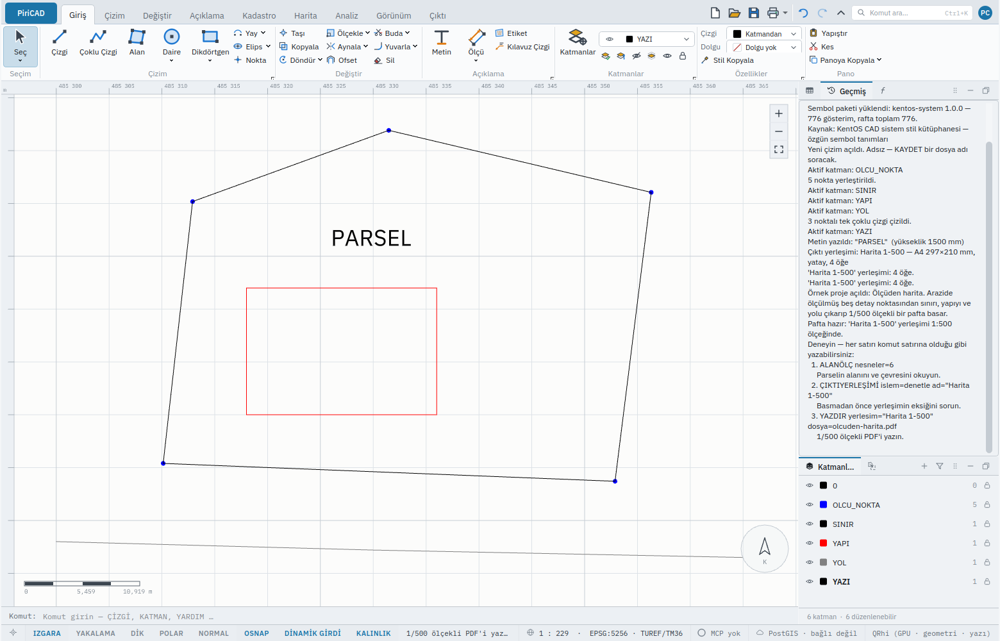
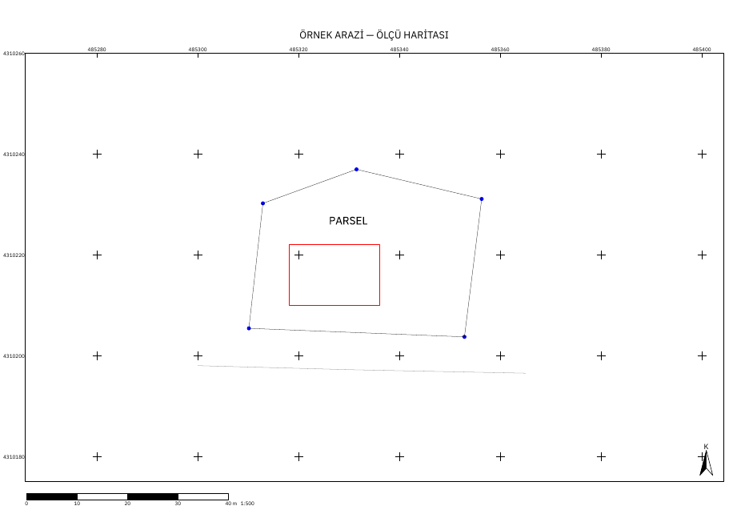

# Örnek Projelerle Başlayın

PiriCAD'i ilk kez açan ve boş tuvale bakıp nereden başlayacağını bilmeyen herkes için. Bu
sayfayı bitirdiğinizde hazır bir örnek projeyi açmış, onu düzenlemiş ve **ölçeği doğru bir
pafta** çıkarmış olacaksınız — kurulum dışında başka bir yardıma ihtiyaç duymadan.

Hazır projeler gerçek bir işin küçük bir kopyasıdır: ölçülmüş noktalar, parseller, bir plan.
**Koordinatlar kurgusaldır**; gerçek bir parsele, adaya ya da kişiye ait değildir. Her proje
sizin yazacağınız komutların aynısıyla kurulmuştur; bu yüzden ona yaptığınız her şeyi kendi
çiziminizde de yaparsınız.

## 1. Bir örnek açın

Sol üstteki **PiriCAD** düğmesine basın ▸ **Örnek Projeler**. Sağda beş proje çıkar; birine
tıklayın.


Aynı şeyi komut satırından da yapabilirsiniz (**Ctrl+9** komut satırını açar):

```
ÖRNEKPROJE ad=olcuden-harita
```

Program çizimi kurar ve sağdaki panelde **Geçmiş** sekmesine geçer. Orada projenin ne olduğu
ve **sıradaki denemeler** yazılıdır; her deneme, komut satırına olduğu gibi yazabileceğiniz bir
satırdır.



> Çalıştığınız çizimin üstüne yazar. Pencereden açıyorsanız program önce "kaydedilsin mi?"
> diye sorar; komut satırından yazdıysanız sormaz. Bkz. [`ÖRNEKPROJE`](../komutlar/sample.md).

## 2. Beş proje

| Proje | Ne yapar | Ne öğrenirsiniz |
|---|---|---|
| **Ölçüden harita** | Beş ölçüm noktasından sınır, yapı ve yol; 1/500 pafta | Alan ölçme, yerleşim denetimi, PDF |
| **Parsel düzenleme** | Yan yana üç parsel; numara etiketleri; ada paftası | Alana göre ifraz, öznitelikten etiket |
| **Plan çizimi** | Konut, ticaret ve yeşil alan; 1/1000 plan paftası | Alan ölçme, paftayı basmak |
| **GIS analizi** | Bir dere ve dört bina; bina katları | Tampon, öznitelik |
| **Arazi işi — aplikasyon** | Dört köşe noktası ve bir istasyon | Aplikasyon raporu |

Hepsi aynı yolu izler: açın, bir deneme yapın, çıktı alın.

## 3. Bir şeyi düzenleyin

**Parsel düzenleme** projesini açın. Ortadaki parsel 1200 m²'dir. Onun 400 m²'lik bir parçasını
ayırın:

```text
ÖRNEKPROJE ad=parsel-duzenleme
ALANÖLÇ nesneler=2
ALANİFRAZ yon=485330,4310200 485330,4310240 nesneler=2 alan=400000000
```

İkinci satır parselin alanını söyler. Üçüncü satır parseli, batı sınırına koşut bir çizgiyle
**tam 400,00 m²**'lik bir parçaya ve kalana böler. `alan` metrekare değil **milimetrekaredir**
(400 m² = `400000000`); bu birim, günlükte ve betikte de aynıdır. Yaptığınız şey **tek bir geri
alma adımıdır**: **Ctrl+Z** ifrazı geri alır.

Bölünmüş parselin eski kimliği (2) artık yoktur; yeni parçalara yeni kimlikler verilmiştir.
Eski kimliği yazarsanız program neden olmadığını söyler:

```text
Nesne bulunamadı veya silinmiş: 2. Bu nesne silinmiş: SİL, ifraz ve birleştirme eski kimliği
kaldırıp yenilerini verir. Yeni kimliği SEÇ ile bulun; az önce olduysa GERİAL geri getirir.
```

## 4. Doğru ölçekli çıktı alın

Her yerleşimli proje ölçeğini **taşır**: harita çerçevesi o ölçeğe kilitlidir ve çizimin tamamını
gösterir. **Ölçüden harita** `Harita 1-500` yerleşimiyle açılır. Basmadan önce yerleşimin eksiğini
sorun:

```text
ÇIKTIYERLEŞİMİ islem=denetle ad="Harita 1-500"
```

Sonra PDF'e basın:

```text
YAZDIR yerlesim="Harita 1-500" dosya=olcuden-harita.pdf
```

Ya da şeritte **Çıktı** sekmesi ▸ **Yazdır**. Çıkan sayfa **A4 yatay**dır ve ölçek çubuğu
`1:500` der:



**Ölçeği kendiniz doğrulayın.** 1/500'de kâğıttaki 1 mm zeminde 0,5 m'dir. Sayfadaki ölçek
çubuğu 40 m'dir ve cetvelle **80 mm** çıkmalıdır; her bölümü 10 m, yani **20 mm**'dir. Izgara
işaretleri 20 m aralıklıdır: iki işaret arası **40 mm**. PDF'i yazdırırken yazıcı "sayfaya
sığdır" diyorsa kapatın; sığdırmak ölçeği bozar.

Ölçek **yerleşimin** özelliğidir, ekranın yakınlığının değil. Ekrandaki `1 : 229`, o anki
yakınlaştırmanızı söyler ve hiçbir çıktıyı etkilemez. Ayrıntı: [Yazdırma ve PDF](yazdirma.md),
[`ÇIKTIYERLEŞİMİ`](../komutlar/layout.md).

## 5. Uzmansanız

Menüleri atlayın; aynı şeyi daha kısa yazarsınız:

- **Ctrl+K** komut paletini açar; `örnek` yazıp Enter.
- Komut satırında kısaltma yeter: `ÖRNEK ad=plan-cizimi`.
- Her denemenin kendi komutu vardır; fareyle yaptığınız hiçbir şey yazılamaz değildir. Bir
  projenin kurulumunu ve sonrasında yaptıklarınızı **günlükte** görürsünüz, olduğu gibi yeniden
  oynatabilir ve bir betik olarak kaydedebilirsiniz ([Betik yazma](../betik/README.md)).
- Kendi projeleriniz için aynı yolu kullanın: komutları bir JSON betiğine koyun, `BETİK` ile
  çalıştırın. Örnek projelerin betikleri `data/ornekler` klasörünüzdedir; açıp bakın.

## 6. Bir şey ters giderse

Mesaj, neyin sorun olduğunu ve ne yapacağınızı söyler. İlk dakikada en çok görülenler:

| Mesaj | Anlamı | Ne yapın |
|---|---|---|
| `Nesne bulunamadı veya silinmiş: 99. Çizimde bu kimlikte hiç nesne olmadı (verilen son kimlik 6). …` | Yazdığınız kimlik hiç verilmemiş | Kimliği **SEÇ** ya da **NESNEBİLGİ** ile bulun |
| `Nesne bulunamadı veya silinmiş: 2. Bu nesne silinmiş: SİL, ifraz ve birleştirme eski kimliği kaldırıp yenilerini verir. …` | Nesne vardı, bir işlemle yerini yenileri aldı | **SEÇ** ile yeni kimliği bulun; az önce olduysa **GERİAL** |
| `Çıktı yerleşimi yok: 'Yok'. Çizimdeki yerleşimler: Harita 1-500.` | Yerleşim adı yanlış | Mesajdaki adlardan birini yazın |
| `İstenen alana bu yönde ulaşılamadı. İstenen: 400,00 m², en yakın: 399,96 m², …` | Bu yönde bu alan ayrılamıyor | Yönü değiştirin ya da `tolerans=` verin |
| `X koordinatı: sayı bekleniyordu (konum 0); yazılan 'a'. Örnek: 485320.150,4310220.400` | Koordinat sayı değil | Mesajdaki örnekteki gibi, ondalık ayırıcı **nokta** |
| `'noktalar' parametresi nokta listesi bekliyor. Girilen: 10. Nokta iki sayıdır, …` | Bir nokta yerine tek sayı yazıldı | Doğu ve kuzey: `485320.150,4310220.400` |
| `Bilinmeyen komut: 'KATMANLR'. YARDIM yazarak komut listesini görün.` | Komut adı yanlış yazıldı | **Ctrl+K** ile adını arayın |

Daha fazlası: [Sorun giderme](../sorun-giderme.md).

## Sırada ne var

- [`ÖRNEKPROJE`](../komutlar/sample.md) — komutun tam sayfası
- [İlk adımlar](ilk-adimlar.md) — komut satırı, katman, geri alma
- [Yazdırma ve PDF](yazdirma.md) — profiller, ölçek, şifreli PDF
- [Komut sistemi](../komutlar/README.md) — PiriCAD'in çalışma mantığı
