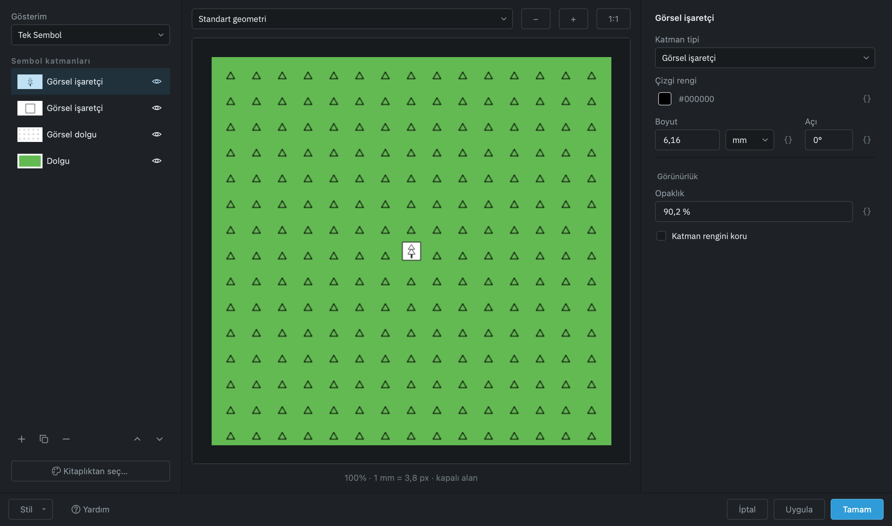
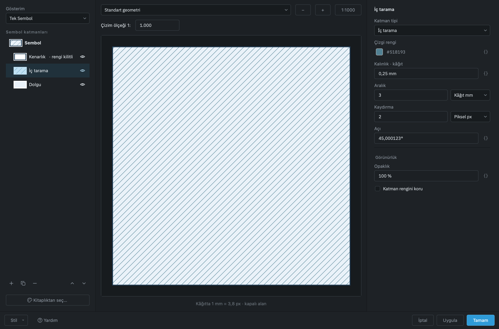

# Stil Tasarımcısı

Bir katmanın nasıl çizileceğini fare ile tasarlamak için. Yazdığı şey `STİL`
komutlarıdır: tasarımcının belgeye giden özel bir yolu yoktur, dolayısıyla burada
kurduğunuz her sembolü bir betik de yazabilir.

## Nasıl açılır

- Katmanlar panelinde katmana **sağ tıklayın → Katman Özellikleri…**
- Şeritte **Görünüm ▸ Katmanlar ▸ Stil Tasarımcısı**
- **Giriş ▸ Özellikler** panelinin adının yanındaki **↘** başlatıcı

Pencere seçili katmanın şu an ne çizdiğiyle açılır: nesneleri bir gösterim
taşıyorsa o, taşımıyorsa katmanın kendi görünümü.

## Pencerede ne nerede

Pencere üç sütun taşır: solda gösterim türü ve sembol katmanları, ortada büyük
canlı önizleme, sağda seçili katmanın özellikleri. Özellik etiketleri girdinin
üstündedir; uç ve birleşim gibi ilişkili alanlar aynı satırda durur.



**Kitaplıktan seç…** kaynak kategori ağacı ve araması olan ayrı bir pencere açar.
Altlıktaki **Stil ▾** menüsünden katman bilgisi ve öznitelikler sayfalarına geçilir.

### Simgeleyici satırı

Soldaki **Gösterim** açılır listesi katmandaki nesnelerin sembollerini neyin
belirlediğini seçer. QGIS'in simgeleyici listesinin bu programın kurallarına çevrilmiş
hâlidir; her biri bir katalog paketi ve tek bir `STİL` satırına iner, o yüzden
tasarımcıda kurduğunuz her şey komut satırından da yazılabilir.

| Simgeleyici | Ne yapar |
|---|---|
| **Tek Sembol** | Katmandaki her nesne aynı sembolü çizer. Kitaplık ayrı pencereden açılır. |
| **Kategorize Edilmiş** | Bir sütunun her **değeri** kendi sembolünü alır: `plan_fonksiyon = Konut` bir renk, `Ticaret` başka bir renk. |
| **Derecelendirilmiş** | Sayısal bir sütun **aralıklara** bölünür; her aralık bir sınıftır: alanı 0–500 m² olanlar bir sembol, 500–2 000 başka bir sembol. |
| **Kural Tabanlı** | Faz 2'de gelecek. Bir kural tek bir alan üzerinde tek sınamadır — eşitlik, liste, aralık, var — ve serbest ifade dili bu programda yoktur. |

Tek Sembol dışında bir simgeleyici seçince soldaki gruba iki denetim daha gelir: **DEĞER**
(sınıflandırılacak sütun; derecelendirmede yalnız sayısal sütunlar listelenir) ve
**RENK SKALASI** (sınıflara verilecek renkler: *Ayrık renkler* renk çemberinde eşit
aralıklı tonlar, *Tek renk açılımı* sembolün kendi rengini koyudan açığa, *Gri tonlar*).

### Sınıf tablosu

Kategorize ya da derecelendirilmiş simgeleyicide çalışma alanının üstünde sınıf
tablosu görünür:

```text
┌──┬────────┬──────────────┬──────────────────────┬────────┐
│✓ │ sembol │ değer        │ gösterim adı         │  nesne │
├──┼────────┼──────────────┼──────────────────────┼────────┤
│✓ │ ▬▬▬    │ Konut        │ Konut Alanı          │    612 │
│✓ │ ▬▬▬    │ Ticaret      │ Ticaret + Hizmet     │    138 │
│✓ │ ▬▬▬    │ ‹diğer›      │ diğer değerler       │     32 │
└──┴────────┴──────────────┴──────────────────────┴────────┘
 [Sınıflandır] [Ekle] [Sil] [Tümünü sil]           [Gelişmiş ▾]
```

- **Sınıflandır** sütundaki her değer için bir satır kurar (derecelendirmede **SINIF**
  sayısı ve **YÖNTEM** — *Eşit aralık* ya da *Eşit sayı* — ile aralıkları böler),
  renkleri skaladan verir ve nesne sayılarını yazar.
- **‹diğer›** satırı her zaman vardır ve silinemez: hiçbir sınıfa girmeyen ya da değeri
  boş olan nesneler onun sembolünü alır. Bir sınıfın işaretini kaldırırsanız nesneleri
  ‹diğer›'e düşer.
- Bir satıra tıklayınca sağdaki sembol düzenleyici **o sınıfın** sembolünü açar;
  seçili sembol katmanının adı sağdaki formun başlığında görünür. Katman ekleyip renk değiştirirseniz
  tablodaki örnek anında yenilenir.
- **Gösterim adı** hücresine çift tıklayıp lejantta okunacak adı yazabilirsiniz;
  **değer** hücresi de elle düzenlenebilir (`Ekle` ile eklenen sınıflar için).

**Uygula** ya da **Tamam** dediğinizde tasarımcı sınıfları bir gösterim paketi olarak
yazar — uygulama ayar dizininde `stiller/siniflar/` altına, katman adıyla — ve tek satır
çalıştırır:

```text
STİL katman="Kadastro Parselleri" paket="…/stiller/siniflar/kadastro-parselleri-….json"
```

Paket, her sınıf için bir stil satırı ve bir kural taşır: `kosullar` içinde `esittir`
(kategorize) ya da `aralik` (derecelendirilmiş), en sonda koşulsuz ‹diğer› kuralı.
Komut her nesnenin sütununu kurallara göre okur ve stil sütununu yazar; aynı paketi
bir betikten vermek aynı sonucu verir. Pencereyi bir sonraki açışınızda sınıflar
paketten geri okunur; semboller ise belgeden alınır, çünkü Uygula'dan sonra doğru olan
belgedir.

Sınıflandırma **katmanın kendi sütunlarını** kullanır; sütun yoksa önce Öznitelikler
sayfasında tanımlayın.

### Veriye bağlı özellikler — `{ }`

Sağdaki özellik satırlarının sonunda `{ }` işareti olanlar bir **sütundan** alınabilir:
çizgi rengi, dolgu rengi, kalınlık, boyut, açı, saydamlık ve yazı. İşarete tıklayın,
listeden sütunu seçin; işaret maviye döner, kutu kilitlenir ve değer artık her nesnenin
kendi sütunundan gelir — kat adedine göre kalınlık, fonksiyon koduna göre yazı gibi.
**Bağı kaldır** eski duruma döndürür. QGIS bu düğmeye *veriye bağlı geçersiz kılma* der;
burada karşılığı `STİL … alan="sütun:özellik:tür"` argümanıdır ve Uygula onu yazar.

Renk için tam sayı ya da `#RRGGBB` metin sütunu, ölçüler için sayısal sütun, yazı için
her sütun seçilebilir.


### Ölçü birimleri ve önizleme ölçeği

Boyut, aralık, kaydırma ve faz alanları kendi birim seçicisini taşır:

| Birim | Girdi | Ölçek değişince |
|---|---|---|
| **Kâğıt mm** | Paftadaki milimetre | Ekrandaki boyut sabit kalır. |
| **Zemin m** | Çizimdeki metre | Yakınlaştırınca büyür, uzaklaştırınca küçülür. |
| **Piksel px** | Tam sayı ekran pikseli | Ekrandaki boyut sabit kalır. |

**Çizim ölçeği 1:** alanı önizlemenin ölçeğidir. `+`, `−` ve tekerlek bu
ölçeği değiştirir; **1:1000** başlangıç ölçeğine döner. Örneğin 3 m zemin aralığı
1:500'de, 1:1000'e göre iki kat geniş görünür; 3 mm kâğıt aralığı değişmez.
Çizgiler ekranda ayırt edilemeyecek kadar sıklaşınca tarama bir renk tonu olarak
gösterilir; yakınlaştırınca çizgiler yeniden görünür.

Birim değiştirmek mevcut boyutu **önizleme ölçeğinde koruyarak** değeri dönüştürür.
1:1000'de 3 mm kâğıt aralığı 3 m zemine veya yaklaşık 11 px'e dönüşür. Piksel
ölçüsü tam sayıya yuvarlanır; sıfır olmayan bir ölçü yuvarlamayla sıfır olmaz.
Piksel alanında ok tuşu birer piksel ilerler. Bir dönüşümden sonra çizim ölçeğini
kontrol edin: zemin ölçüsü artık o ölçekle birlikte değişir.

Aynı katmanda boyut ve aralık farklı birimlerde olabilir. Sol ağaçtaki **Sembol**
satırı bütün sembolün ayarlarını açar. Genel birim seçimi bütün ölçüleri, faz dahil,
dönüştürür; **Opaklık** ve **Kalınlık** yalnız kendi özelliklerini değiştirir.
Çizgi kalınlığı her zaman kâğıt milimetresidir ve ölçekle büyümez.

**Otomatik**, boyut/aralık için çizicinin varsayılanını; **Aralık ile aynı**, ikinci
eksenin birinci aralığı kullanmasını belirtir. Kaydırma ve faz negatif olabilir.

### Kenarlık, dolgu ve iç tarama birlikte



**Katman ekle (+)** alan sembollerinde **Kenarlık**, **İç tarama**, **Dolgu** ve
**Çapraz tarama** seçeneklerini sunar. Her biri aynı sembole ayrı bir katman ekler;
mevcut kenarlığı iç taramayla birlikte kullanabilirsiniz. Çapraz tarama iki ayrı
45°/135° tarama katmanı ekler; renk, açı, aralık ve opaklıklarını bağımsız düzenleyin.

Yeni dolgu ve tarama katmanları mevcut kenarlığın altında yerleşir. Ağaçtaki en
üst katman son çizilir; **Yukarı/Aşağı** ile sırayı değiştirin, göz simgesiyle bir
katmanı gizleyin. İç taramanın zemini için ayrıca **Dolgu** ekleyin; tarama formunda
çizicinin kullanmadığı bir arka plan rengi bulunmaz.

Aynı stili taşıyan iki ayrı alan üst üste geldiğinde kesişimleri de dolgulu veya
taralı görünür. İç içe çizilen ayrı bir alan kendiliğinden delik oluşturmaz;
yalnız polygonun açıkça tanımlanmış iç halkaları boş bırakılır. Başka bir alan
bu deliği örtüyorsa o alanın stili burada da çizilir. Sahne ve PDF aynı kurala uyar.

Bu düzen [QGIS'in sembol katmanları yaklaşımını](https://docs.qgis.org/3.44/en/docs/user_manual/style_library/symbol_selector.html)
izler: ortak sembol ayarları ile her çizgi, dolgu ve desen katmanının ayarları ayrıdır.

### Geometri

İlk karar bu: sembol hangi geometri için. Katman geometriyi belirtmiyorsa sol sütunda durur — üçü de sembolün *ne olduğuna* dair kararlardır, nasıl
göründüğüne dair değil. İki şeyi birden belirler: önizlemenin hangi şekil
üzerinde çizileceğini ve rafın hangi çekmecesinin açık olduğunu. `Çizgi`
seçiliyken raf size alan gösterimi vermez.

Yalnız **katman kendisi söylemiyorsa** görünür: boş bir katmanda ya da hem çizgi
hem alan taşıyan bir katmanda. Parsel katmanı alandır, yol ekseni katmanı
çizgidir; çizim bunu zaten söylüyorsa bu kontrol gösterilmez ve sembol o
geometri için kurulur.

Önizleme şekli de bilerek seçilmiştir: alan için dikdörtgen, çizgi için **zikzak**
(düz çizgi bir desenin köşede ne yaptığını gizler), nokta için tek nokta. Büyük
önizlemenin altındaki tek kelime — *kapalı alan*, *kırıklı çizgi*, *tek nokta* —
resmin hangi geometri üzerinde çizildiğini söyler; sekmeyi değiştirince o da değişir.

### Hazır gösterimler

**Kitaplıktan seç…** penceresinde varsayılan KentOS sistem kataloğu bulunur:
695 sembol ve 81 SVG öğesi, kaynak kategori yollarıyla birlikte. MPYY grupları
kaynaktaki düzeni izler: EK-1a ortak, EK-1b MSP, EK-1c ÇDP, EK-1ç NİP, EK-1d
UİP, her ekin altında kendi bölümleri. Raf bir **liste**dir ve **ekin kendisi
gibi bölümlenmiştir**: her grup yolu bir başlık olarak bir kez yazılır
(`EK-1a / SINIRLAR / İDARİ SINIRLAR`), altında o bölümün gösterimleri. Her
satırda gösterimin gerçek görseli ve tam adı; üzerine gelince kimliği ve
dayanağı.

Gösterim görselleri **her temada beyaz kâğıt üzerinde** çizilir ve satırın
solundaki kendi sütununda, ince çerçeveli birer numune kartı olarak durur. Raftaki
bütün yazı — bölüm başlıkları ve gösterim adları — kartların bittiği yerden
başlar, yani tek bir sol kenarı paylaşır. Bir gösterim
imzalanacak bir pafta üzerindeki mürekkeptir ve o pafta beyazdır; koyu temanın
zemininde çizilseydi siyah çizgili gösterimlerin yarısı görünmezdi.

Yürürlükten kalkmış bir gösterim satırın sağ ucunda **yürürlükte değil** diye
işaretlenir. Yüklenebilir olarak kalır — emekliye ayrılmış bir kimlik hiç
düşürülmez — ama yeni bir paftada seçilmemelidir.

- Soldaki kategori ağacından bir ek ya da bölüm seçin, ya da
- Arama kutusuna yazın — arama **grubu dinlemez**, bir kelimeyi nerede olursa
  bulur.

Satırdaki görseller taramanın, çizgi tipinin ve simgenin **gerçek
görselleridir**; renk değil. `Seçileni kullan` ya da çift tıklama, o gösterimi
yığına **koyar** — üstüne eklemez, çünkü yayımlanmış bir gösterimi seçmek "bu
böyle görünmeli" demektir.

Bir satır seçtiğinizde rafın altına **seçim şeridi** yapışır: solda o satırın
dayanağı — yönetmelik, ek, madde ve yayım tarihi — sağda `Seçileni kullan`.
Hiçbir satır seçili değilken şerit yoktur. Basınca uygulanacak şeyin künyesi
düğmeyle aynı satırda durur.

Kaç gösterimin listelendiği **arama kutusunun yanında** yazar: sayıyı değiştiren
iki kontrolün yanında. Raf çok kalabalıksa ilk kaç tanesinin gösterildiğini de
orası söyler; sessizce kesilmez.

### Sembol katmanları

Sol sütundaki **SEMBOL KATMANLARI** listesi. **Üstten alta** okunur:
ilk satır en son çizilen, yani ekranda en üstte görünen katmandır. `▲` ve `▼`
satırı gördüğünüz yöne taşır. Listede yalnız katmanlar vardır; sembolün
**kendisine** ait özellikler (birim, renk, kalınlık, saydamlık) için önizleme
resmine tıklayın — o zaman sağdaki form bütün katmanlara birden uygulanan
ayarları gösterir.

Her satırın sağındaki **göz** o katmanı **kapatır**; kapalı katmanın gözü çizili,
adı soluk görünür. Kapalı katman silinmez — sembolde durur, dosyaya yazılır,
parmak izine girer — sadece çizilmez. Bir katmanın ne kattığını görmek için
kapatıp açmak en hızlı yoldur.

`⧉` seçili katmanı kopyalar; iki farklı kalınlıkta aynı çizgi (yol kaplaması)
böyle kurulur.

### Katman özellikleri

Sağ sütunda seçili katmanın kullandığı özellikler bulunur;
etiketler değerlerin üstündedir:

| Başlık | İçinde ne var |
|---|---|
| **KATMAN** | Katman tipi; tipe göre yazı, şekil, yerleşim |
| **DOLGU** | Dolgu rengi |
| **KENAR** | Çizgi rengi, kalınlık, uç biçimi, birleşim |
| **GEOMETRİ** | Boyut, aralık, ikinci eksen, kaydırma, açı, faz |
| **GÖRÜNÜRLÜK** | Saydamlık, renk kilidi |

Yalnız **seçili tipin okuduğu** satırlar gösterilir, ve içinde satırı olmayan bir
başlık da gösterilmez. Bir `dolgu` katmanının işaretçi yerleşimi yoktur, o yüzden
o satır orada değildir — soluk değil, yok. Görmediğiniz bir alan, çizicinin yok
sayacağı bir alan değildir.

Birim, etikette değil değerin yanındadır: kalınlık `mm`, açı `°` sonekiyle yazılır.
Her ölçünün **kendi birim kutusu** vardır: boyut kâğıtta, aralık zeminde
olabilir. İkisi aynı sembolde farklı birimlerde durabilir ve bu normaldir.

Önizlemeler tuvalin **kendi arka ucundan** geçer. Yani gördüğünüz küçük resim,
çizimde göreceğiniz şeyin aynısıdır — ayrı bir önizleme çizicisi olsaydı ikisi
er geç ayrışırdı.

## Katman özellikleri

Her alan `STİL` komutunun bir parametresidir; hangisi olduğu
[STİL sayfasında](../komutlar/style.md) tablo hâlinde yazılı.

| Başlık · Alan | `STİL` parametresi |
|---|---|
| KATMAN · Katman tipi | `tip` |
| KATMAN · Şekil | `sekil` |
| KATMAN · Yerleşim | `yerlesim` |
| DOLGU · Dolgu rengi | `dolgu` |
| KENAR · Çizgi rengi | `renk` |
| KENAR · Kalınlık | `kalinlik` |
| GEOMETRİ · Boyut + birim | `boyut`, `birim` |
| GEOMETRİ · Aralık | `aralik` |
| GEOMETRİ · İkinci eksen | `aralik_y` |
| GEOMETRİ · Kaydırma | `kaydirma` |
| GEOMETRİ · Açı | `aci` |
| GÖRÜNÜRLÜK · Saydamlık | `saydamlik` |

Tip kutusu kullanıcıya okunur adları gösterir. Komut adları STİL sayfasındaki
parametre tablosunda bulunur.

### Sembol parametreleri

Bir sembol katmanı, çizeceği değeri nesnenin **öznitelik sütunundan** alabilir:
dairenin içine `taks` sütununu yazdırmak, çizgi kalınlığını `kat` sütununa
sürmek gibi. Bunu bugün [`STİL alan=`](../komutlar/style.md) ile yazarsınız.

Sağdaki `{ }` düğmeleriyle sütun seçilir. Bağlar, bütün sembol yığını ve
görsellerle birlikte pakete yazılır; uygulama tek `STİL` komutudur.

## Öznitelikler sayfası

Çizimdeki nesnelerin taşıyabileceği **sütunlar** burada tanımlanır: `ada`, `parsel`,
`onay_tarihi`, `oran`. Tablo tanımlı bütün sütunları gösterir; altındaki **Ekle…**,
**Düzenle…** ve **Sil** düğmeleri [`SÜTUN`](../komutlar/column.md) komutunu gönderir.

Sütun türleri ve her birinin ne tuttuğu o sayfada yazılıdır. Kısaca: `metin`,
`tam_sayi`, `ondalik`, `uzunluk`, `evet_hayir`, `tarih`, `kod`.

Tanımladığınız sütun, o nesne seçildiğinde sağdaki **Öznitelikler** panelinde kendi
satırıyla çıkar ve türüne uygun düzenleyiciyle açılır — tarihe takvim, evet/hayıra iki
kelimelik segment.

**Buradan tanımlanan sütun yalnız bu katmana aittir.** Çizimin tamamına ait bir alan
— `ada`, `parsel` gibi — **PiriCAD ▸ Proje Ayarları… ▸ Öznitelikler** sayfasında
tanımlanır.

Sayfa proje sütunlarını da listeler, `proje sütunu` diye işaretli ve düzenlenemez
hâlde: bu katmandaki bir nesnenin taşıyacağı alanların tamamı odur.

## Stil ▾ menüsü

Alt çubuğun solundaki **Stil ▾** düğmesi üç işi taşır:

| Kalem | Ne yapar |
|---|---|
| **Katmanın çizdiğine dön** | Bu penceredeki değişiklikleri atar; katmana dokunmaz |
| **Stili temizle** | `STİL katman=… sifirla=evet` gönderir: katmanın stili silinir, nesneler katman görünümüne döner |
| **Sembolü kütüphaneye kaydet…** | Sembolü kendi gösterim paketiniz olarak diske yazar |

**Stili temizle** eskiden katmanın sağ tık menüsündeydi. Bir stili silmek, bir stili
kurmakla aynı pencerede durur; katmanın menüsü ise katmanın kendisiyle ilgili
kalemlere ayrıldı.

## Uygula

**Uygula**, bütün yığını, her ölçünün birimini, özellik bağlarını ve SVG
içeriklerini bir paket olarak tek `STİL katman=… paket=… kod=…` satırıyla uygular.
Kapalı katmanlar da saklanır; görünürlüğü kapalı kalır. Tek bir **GERİAL** tasarımı
bütünüyle geri alır.

## Kütüphaneye kaydet

**Kütüphaneye kaydet…** sembolü uygulamanın kendi ayar dizinine bir **gösterim
paketi** olarak yazar:

| Sistem | Yer |
|---|---|
| Linux | `~/.config/PiriCAD/stiller/` |
| Windows | `%APPDATA%\PiriCAD\stiller\` |
| macOS | `~/Library/Application Support/PiriCAD/stiller/` |

Proje dizinine değil: tasarladığınız sembol size aittir, çizimden çizime sizinle
gelir ve birinin paftasının yanında takip edilmeyen bir dosya olarak durmamalıdır.

Kaydedilen dosya normal bir gösterim paketidir. Kaydedince kitaplığa eklenir;
sonraki açılışta da yüklenir. Başka bir makinede elle yüklemek için:

```
SEMBOL paket="<ayar dizini>/stiller/benim-stilim.json"
```

Kullanıcı stili ile yayımlanmış gösterim, bundan sonrası için aynı türden şeydir.

## Neden QGIS'in penceresi doğrudan kullanılmıyor

Lisans engel değil — QGIS GPL-2.0-or-later ve uyumlu. Engeller ölçülebilir:

- `libqgis_gui` **254 paylaşımlı kütüphane** ve 75 MB getiriyor.
- `QgsApplication::initQgis()` sağlayıcı kaydını ve SRS veritabanını yüklüyor;
  bu programın soğuk açılış bütçesi **2 saniye**.
- Gidiş-dönüş tam da bizim bilerek ayrıldığımız yerde kayıplı:
  `QgsRasterFillSymbolLayer` bir **dosya yolu** tutar, PiriCAD'in görsel dolgusu
  ise baytları ve künyesini belgenin içinde taşır — çizim e-postayla gittiğinde
  ayakta kalmasını sağlayan şey bu.

Düzenleyici, KentOS çalışma alanını PiriCAD bileşenleriyle kullanır. QGIS bunu iki
pencereye bölüyor (sembol seçici ve Stil Yöneticisi) ve seçili tipin okumadığı
alanları da soluk hâlde gösteriyor. Burada tek pencere var ve görünmeyen alan yok
sayılan alan değildir.
