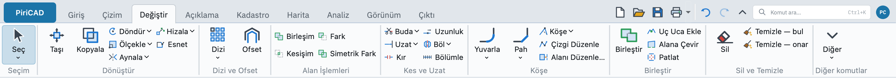

# BİRLEŞİM — Birleşim

Kapalı alanları düzenleyen kullanıcılar için; bu sayfayla birleşim işlemini şeritten, komut satırından ve betikten yapabilirsiniz.

## Ne yapar

En az iki kapalı alanın bütününü oluşturur. Ayrı kalan bölgeler ayrı sonuç nesneleridir. İşlem [OpenCASCADE](../veri/geometri-cekirdegi.md) üzerinden yürür; doğru ve yay sınırları korunur, sonuç ilk kaynağın katmanında oluşturulur.

Çok parçalı bir alanın her dış halkası kendi delikleriyle işlenir; diğer parçalar delik sayılmaz.

Varsayılan olarak sonuç kaynakların yerine geçer. `kaynaklari_koru=evet` kaynakları da saklar. Sonuç boşsa kaynaklar daima korunur.

Ortak stil ve aynı öznitelik değerleri korunur. Ayrışan stil katman stiline döner; ayrışan sütunlar boş bırakılır ve cevapta belirtilir.

## Adlar

`BİRLEŞİM` · BIRLESIM · UNION · ABR · `core.area_union`.

## Sözdizimi

```text
BİRLEŞİM [nesneler=<kimlikler>] [kaynaklari_koru=<evet|hayır>]
```

## Parametreler

En az iki kapalı alan gerekir. Parametrelerin tam tanımı [oluşturulmuş komut referansında](referans.md) bulunur. Kaynaklar düz alan, kapalı yaylı çoklu çizgi veya daire olabilir. Tek seçili alanla başlanırsa diğer girdi sorulur.

## Örnekler

```
ALAN 0,0 10,0 10,10 0,10
ALAN 5,5 15,5 15,15 5,15
BİRLEŞİM nesneler=1 nesneler=2
```

Sonuç 175 m² alandır. Şeritte **Değiştir ▸ Alan İşlemleri ▸ Birleşim** düğmesini kullanın. Alan seçildiğinde açılan **Alan** sekmesinde, daire seçildiğinde **Eğri** sekmesinde de aynı grup bulunur. Klavyede `BİRLEŞİM` yazıp Enter'a basın; nesneleri seçip Enter ile tamamlayın.



Görüntü gerçek uygulamadan, 1440 piksel pencere genişliğinde alınmıştır.
Aynı görüntüyü yeniden üretmek için:

```bash
PIRICAD_DATA="$PWD/data" PIRICAD_RIBBON_SHEET=/tmp/piricad-serit ./build/dev/bin/piricad
```

## Geri alma

`GERİAL` bütün sonuçları kaldırır ve kaynakları tek adımda geri getirir. `YİNELE` aynı sonucu yeniden oluşturur. İşlem çalışırken **Durdur**, seçim sırasında Esc hiçbir sonuç bırakmaz.

## Betikten kullanım

JSON koordinatları milimetredir; aşağıdaki tam betik aynı örneği çizer.

```json
{
  "ad": "Birleşim örneği",
  "komutlar": [
    {"cmd": "core.area", "args": {"noktalar": [[0, 0], [10000, 0], [10000, 10000], [0, 10000]]}},
    {"cmd": "core.area", "args": {"noktalar": [[5000, 5000], [15000, 5000], [15000, 15000], [5000, 15000]]}},
    {"cmd": "core.area_union", "args": {"nesneler": [1, 2]}}
  ]
}
```

## Hatalar

- “Birleşim en az iki kapalı alan ister.”: iki farklı alan sağlayın.
- “Nesne kimlikleri pozitif ve birbirinden farklı olmalı.”: aynı kaynağı iki kez vermeyin.
- “Nesne bulunamadı: …”: canlı nesne kimliklerini kullanın.
- “Nesne … kapalı bir alan değil. Alan, kapalı yaylı çizgi veya daire seçin.”: açık çizgileri önce kapatın.
- “Nesne … geçersiz bir alan sınırı içeriyor; kaynaklar değiştirilmedi.”: kendi kendini kesen sınırı düzeltin.
- “Sonuç eğrili bir sınır ve delik içeriyor; bu alan biçimi henüz kaydedilemiyor. Kaynaklar değiştirilmedi.”: mevcut belge modeli eğrili ve delikli sonuçları birlikte saklamaz; işlem tamamen geri alınır. Elips/spline sınırlarını değiştiren bu komutlar da henüz desteklenmez; sessizce düz çizgiye çevrilmez.
- “OpenCASCADE alan işlemini tamamlayamadı; kaynaklar değiştirilmedi.”: kaynak geometrisini denetleyin; kısmi sonuç kaydedilmez.
