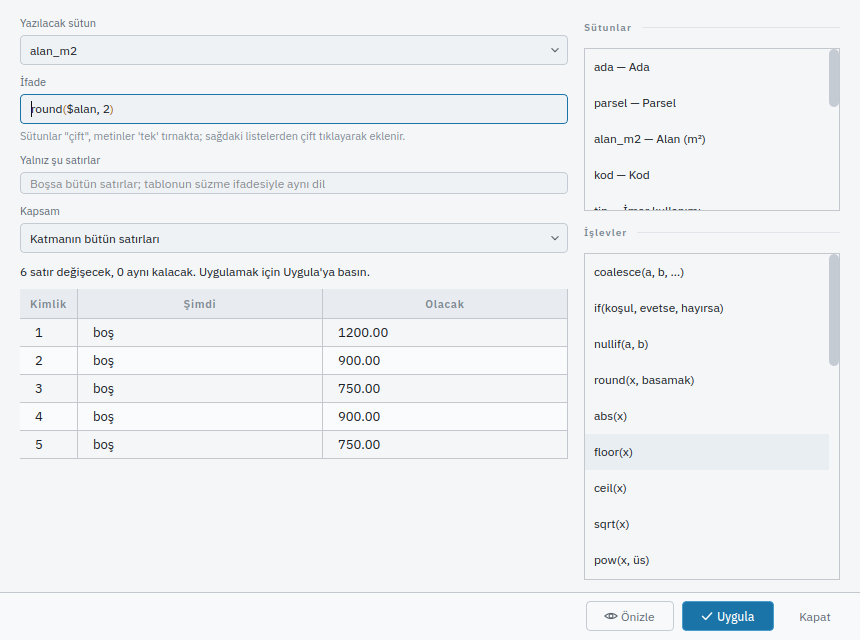
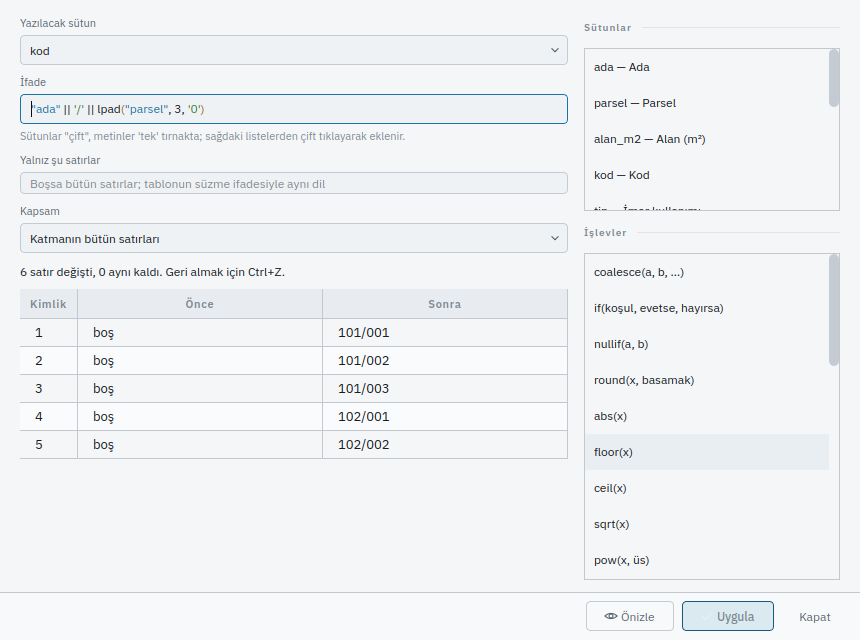

# ÖZNİTELİKHESAPLA — Alan Hesaplayıcı

Bir sütunun bütün satırlarına aynı hesabı uygulamak isteyen herkes için: parsel
alanlarını sütuna yazmak, ada ve parsel numarasından bir kod kurmak, bir kategoriye göre
imar kullanımı atamak. Bu sayfayı bitirdiğinizde bir ifadeyi satırlar üzerinde önce
önizleyip sonra tek adımda yazmayı, yazılanı tek adımda geri almayı bileceksiniz.

## Ne yapar

`ÖZNİTELİKHESAPLA`, `ifade`yi her satır için hesaplar ve sonucu `ad` ile verilen
[sütuna](column.md) yazar. İfade, tabloda süzme için kullanılan dilin aynısıdır:
**[İfade dili](../veri/ifade-dili.md)** sayfasındaki her şey burada da geçerlidir.

```text
round($alan, 2)                                          alanı iki ondalıkla
"ada" || '/' || lpad("parsel", 3, '0')                   101/001 gibi bir kod
CASE WHEN "alan_m2" > 1000 THEN 'Büyük' ELSE 'Küçük' END  bir seçim
```

**Kapsam.** Hangi satırların hesaplanacağı şu sırayla belirlenir:

1. `nesneler=` verilmişse yalnız o nesneler.
2. Yoksa `katman=` verilmişse o katmanın bütün satırları.
3. O da yoksa çizimde **seçili** nesneler.
4. Seçim de boşsa **etkin katman**.

`filtre=` bunların üstüne biner ve yalnız ifadesinin doğru çıktığı satırları bırakır;
süzgece uymayan satırlara dokunulmaz ve özette sayılır.

**Önce hesaplar, sonra yazar.** Bütün satırlar hesaplanmadan hiçbir hücre yazılmaz.
Tek bir satırda ifade hata verirse (sıfıra bölme, sayıya çevrilemeyen bir metin, tam
sayı sütununa sığmayan bir kesir) **hiçbir satır değişmez** ve mesaj hangi nesnenin hangi
sebeple reddedildiğini söyler.

**Sonuç sütunun türüne çevrilir.** Yazı sütununa metin, tam sayı sütununa tam sayı
gider. Tam sayı sütununa `12.5` yazılmak istenirse hesap **reddedilir**, yuvarlanmaz:
sessizce yuvarlanan bir değer, söylenmemiş bir şeyi söylemek olurdu. `round`, `floor`
ya da `ceil` ile açıkça yuvarlayın. **Uzunluk** sütununa yazılan sayı **metredir** (tablonun
gösterdiği birim); belge milimetre saklar. Ondalık sütuna sütunun kendi basamak sayısından
fazla basamaklı bir sonuç yazılamaz.

**Boş sonuç hücreyi boşaltır.** İfade boş (NULL) çıkarsa hücre boşalır ve özette
"boşaltıldı" diye sayılır. Bir hücrenin zaten istenen değerde olması değişiklik sayılmaz
(`aynı kaldı`).

**Önizleme.** `onizle=evet` hiçbir şey yazmaz: neyin değişeceğini, ilk beş satırı
"şimdi → olacak" olarak söyler. Hesaplayıcı penceresi her zaman önce önizler.

## Adlar

| Türkçe | Tür |
|---|---|
| `ÖZNİTELİKHESAPLA` | Ana ad |
| `OZNITELIKHESAPLA` | ASCII karşılık |
| `ALANHESAPLA`, `ÖHESAPLA`, `OHESAPLA` | Kısaltmalar |
| `FIELDCALC` | İngilizce karşılık |
| `core.attribute_calc` | Komut kimliği |

## Sözdizimi

```text
ÖZNİTELİKHESAPLA ad=<sütun> ifade=<ifade> [katman=<ad>] [filtre=<ifade>] [onizle=evet|hayir] [nesneler=<k1> nesneler=<k2> …]
```

## Parametreler

| Parametre | Ne yapar |
|---|---|
| `ad` | Hesabın yazılacağı sütunun kimliği; [`SÜTUN`](column.md) ile tanımlı olmalıdır |
| `ifade` | Hesaplanacak ifade. Sütunlar `"çift"`, metinler `'tek'` tırnakta. Komut satırında ifadenin kendisi tırnak içine alınır, içindeki çift tırnak `\"` yazılır |
| `katman` | Bu katmanın bütün satırları; yoksa seçim, o da boşsa etkin katman |
| `filtre` | Yalnız bu ifadenin doğru çıktığı satırlar; tablonun süzme çubuğuyla aynı dil |
| `onizle` | `evet` ise hiçbir şey yazılmaz, neyin değişeceği söylenir. Varsayılan `hayır` |
| `nesneler` | Yalnız bu nesnelerin kalıcı kimlikleri; verilirse `katman` ve seçim yok sayılır |

Komut satırında `ad` verilmezse program hangi sütuna yazılacağını sorar ve tanımlı
sütunları sayar.

## Örnekler

### Komut satırı

Üç parsel çizin, sütunları tanımlayın ve ada ile parsel numaralarını yazın:

```
KATMAN ad=PARSEL
DİKDÖRTGEN 0,0 40,30
DİKDÖRTGEN 50,0 80,30
DİKDÖRTGEN 90,0 120,25
SÜTUN kimlik=ada tur=tam_sayi ad="Ada"
SÜTUN kimlik=parsel tur=tam_sayi ad="Parsel"
SÜTUN kimlik=alan_m2 tur=ondalik basamak=2 ad="Alan (m²)"
SÜTUN kimlik=kod tur=metin ad="Kod"
SÜTUN kimlik=tip tur=metin ad="İmar kullanımı"
ÖZNİTELİK ad=ada nesneler=1 nesneler=2 nesneler=3 deger=101
ÖZNİTELİK parsel 1 1
ÖZNİTELİK parsel 2 2
ÖZNİTELİK parsel 3 3
```

Önce önizleyin; hiçbir şey yazılmaz:

```
ÖZNİTELİKHESAPLA ad=alan_m2 ifade="round($alan, 2)" katman=PARSEL onizle=evet
```

Döküm neyin değişeceğini söyler:

```text
Önizleme (hiçbir şey yazılmadı): alan_m2 = round($alan, 2)
  kapsam: 'PARSEL' katmanı (3 nesne)
  3 satır değişecek · 0 aynı kaldı · 0 boşaltıldı
  [1] boş → 1200.00
  [2] boş → 900.00
  [3] boş → 750.00
```

Beğendiyseniz aynı satırı `onizle` olmadan gönderin:

```
ÖZNİTELİKHESAPLA ad=alan_m2 ifade="round($alan, 2)" katman=PARSEL
```

İki sütundan bir kod kurun — `\"` ifadenin içindeki çift tırnaktır:

```
ÖZNİTELİKHESAPLA ad=kod ifade="\"ada\" || '/' || lpad(\"parsel\", 3, '0')" katman=PARSEL
```

Yalnız bir koşulu sağlayan satırlara yazın. Burada alanı 800 m²'den küçük parseller
"Ticaret" olur:

```
ÖZNİTELİKHESAPLA ad=tip ifade="'Ticaret'" filtre="\"alan_m2\" < 800" katman=PARSEL
```

Yalnız seçili nesnelere yazmak için önce seçin; `katman` vermeyin:

```
SEÇ nesneler=1 nesneler=2
ÖZNİTELİKHESAPLA ad=tip ifade="'Konut'"
```

### Arayüz

[Öznitelik tablosunun](../veri/oznitelik-tablosu.md) araç satırındaki **ƒ** (Alan
hesaplayıcı) düğmesi pencereyi açar. Pencere tablonun katmanı ve süzme çubuğundaki ifade
ile açılır: "gördüğüm satırlar üzerinde hesapla" için yeniden yazmanız gerekmez.



1. **Yazılacak sütun** listesinden hesabın yazılacağı sütunu seçin.
2. **İfade** çubuğuna ifadeyi yazın. Sağdaki **Sütunlar** listesinde bir sütuna çift
   tıklamak onu ifadeye `"kimlik"` olarak ekler; **İşlevler** listesinde çift tıklamak
   işlevin yazımını ekler. Liste kalemlerinin üzerinde durunca bir cümlelik açıklama
   çıkar. Sütunlar listesi `kimlik — başlık` biçiminde yazar: ifadede **kimlik** kullanılır.
3. İsterseniz **Yalnız şu satırlar** alanına bir süzgeç, **Kapsam** listesinden
   **Katmanın bütün satırları** ya da **Seçili nesneler** seçin.
4. **Önizle** (ya da ifade çubuğunda **Enter**) tabloya örnek satırları **Şimdi** ve
   **Olacak** sütunlarıyla yazar; üstteki cümle kaç satırın değişeceğini söyler. Hiçbir
   hücre değişmez.
5. **Uygula** yalnız bir önizlemeden sonra açılır ve önizlemeden sonra sütunu, ifadeyi,
   süzgeci ya da kapsamı değiştirirseniz yeniden kapanır: tablo artık yazılacak olanı
   göstermez, yeniden **Önizle**'ye basmanız gerekir. Uygulandıktan sonra sütunlar
   **Önce** ve **Sonra** olur ve **Ctrl+Z** hesabın tamamını geri alır.



İfade hatalıysa nedeni ifade çubuğunun altında kırmızı yazar ve hiçbir şey yazılmaz.
Tablodaki bir örnek satıra tıklamak o nesneyi çizimde seçer. Pencere belgeye kendisi
dokunmaz: düğmeler yukarıdaki komut satırını kurar ve veri yoluna verir, bu yüzden
pencereden yapılan hesapla komut satırından yapılan aynı işlemdir ve aynı günlük satırına
düşer.

Klavyeyle: pencere açıldığında odak ifade çubuğundadır; **Tab** sırayla alanlara, listelere
ve düğmelere gider; listelerde **Enter** bir kalemi ifadeye ekler.

### Betik

```json
{
  "ad": "Parsellerin alanını ve kodunu yaz",
  "komutlar": [
    { "cmd": "core.layer", "args": { "ad": "PARSEL" } },
    { "cmd": "core.rectangle", "args": { "noktalar": [[0, 0], [40000, 30000]] } },
    { "cmd": "core.rectangle", "args": { "noktalar": [[50000, 0], [80000, 30000]] } },
    { "cmd": "core.column", "args": { "kimlik": "ada", "tur": "tam_sayi" } },
    { "cmd": "core.column", "args": { "kimlik": "parsel", "tur": "tam_sayi" } },
    { "cmd": "core.column", "args": { "kimlik": "alan_m2", "tur": "ondalik", "basamak": 2 } },
    { "cmd": "core.column", "args": { "kimlik": "kod", "tur": "metin" } },
    { "cmd": "core.attribute", "args": { "ad": "ada", "nesne": 1, "deger": "101" } },
    { "cmd": "core.attribute", "args": { "ad": "parsel", "nesne": 1, "deger": "1" } },
    { "cmd": "core.attribute", "args": { "ad": "ada", "nesne": 2, "deger": "101" } },
    { "cmd": "core.attribute", "args": { "ad": "parsel", "nesne": 2, "deger": "2" } },
    { "cmd": "core.attribute_calc",
      "args": { "ad": "alan_m2", "ifade": "round($alan, 2)", "katman": "PARSEL" } },
    { "cmd": "core.attribute_calc",
      "args": { "ad": "kod", "ifade": "\"ada\" || '/' || lpad(\"parsel\", 3, '0')",
                "katman": "PARSEL" } }
  ]
}
```

## Geri alma

Tek adım. Bir çağrıda kaç satır değiştiyse **hepsi birlikte** geri alınır ve hücreler
eski değerlerine, boş olanlar boşluğa döner. Hesap yarıda hata verirse hiçbir hücre
yazılmaz; işlem bütün olarak geri sarılır.

Önizleme geri alma adımı bırakmaz.

```
GERİAL
```

## Betikten kullanım

Komut kimliği `core.attribute_calc`; parametreler yukarıdaki tabloyla aynıdır. Python'dan
`cad.attribute_calc(name="kod", expression="\"ada\" || '/' || \"parsel\"", layer="PARSEL")`
olarak çağrılır; öbür adlar `filter`, `preview`, `objects`.

Önizleme ve gerçek çağrı betiğe **yapılandırılmış** olarak da döner:

| Alan | Ne |
|---|---|
| `sutun` | Yazılan (ya da yazılacak) sütunun kimliği |
| `ifade` | Hesaplanan ifade |
| `kapsam` | Hangi satırlara uygulandığı, bir cümleyle |
| `onizleme` | `true`: hiçbir şey yazılmadı |
| `satir` | Hesaba giren satır sayısı |
| `degisen` | Değişen (ya da değişecek) satır sayısı |
| `ayni` | Zaten istenen değerde olan satır sayısı |
| `bosaltilan` | Boşalan hücre sayısı |
| `suzgece_uymayan` | Süzgece uymadığı için dokunulmayan satır sayısı |
| `ornekler` | İlk beş değişiklik: `nesne`, `eski`, `yeni` |

Bu, pencerenin tablosunu dolduran yanıtın aynısıdır. Günlüğe `ad`, `ifade`, `filtre` ve
çözülmüş kapsam (`nesneler` ya da `katman`) yazılır: günlük yeniden oynatıldığında aynı
satırlar aynı değeri alır.

Yapay zekâ da bu komutu çağırabilir, ama her öneri gibi **önizlenir ve onaylanır**;
onaysız hiçbir hücre değişmez.

Bir milyon satırlık bir katmanda ölçülmüştür: bir `$x` hesabı yaklaşık üç saniye, bir
`lpad` ile metin kuran hesap yaklaşık iki saniye sürer; hesap tek geri alma adımıdır.

## Hatalar

| Mesaj | Sebep | Çözüm |
|---|---|---|
| `Bilinmeyen sütun: '<ad>'. Tanımlı sütunlar: … Yenisi için SÜTUN kimlik=<ad> tur=<tür>.` | `ad` tanımlı bir sütun değil | Listedeki bir kimliği yazın ya da [`SÜTUN`](column.md) ile tanımlayın |
| `Bilinmeyen sütun: '<ad>'. Belgede hiç öznitelik sütunu yok; önce SÜTUN kimlik=<ad> tur=<tür> ile tanımlayın.` | Belgede hiç sütun yok | Önce `SÜTUN` |
| `Bilinmeyen katman: '<ad>'.` | `katman` çizimde yok | Katman adını Katmanlar panelinden doğrulayın |
| `Bilinmeyen nesne: N. Nesne kimliklerini SEÇ ile görebilirsiniz.` | `nesneler` çizimde olmayan bir kimlik | Kimliği [`SEÇ`](select.md) ile öğrenin |
| `Hesaplanacak satır yok: <kapsam>. nesneler=, katman= ya da bir seçimle kapsamı söyleyin.` | Kapsam boş | Kapsamı verin ya da bir seçim yapın |
| `filtre: …` | Süzgeç ifadesi okunamadı | [İfade dili](../veri/ifade-dili.md) sayfasının hata tablosuna bakın |
| `nesne N ('<katman>' katmanı): '<sütun>' sütunu bu katmana tanımlı değil (sütun '…')` | Sütun başka bir katmana ait | O katmandaki bir sütunu seçin |
| `nesne N ('<katman>' katmanı): <ifade hatası> (ifade: …)` | İfade o satırda hesaplanamadı (sıfıra bölme, olmayan sayı…) | Hata satırı söyler; ifadeyi düzeltin ya da `filtre` ile o satırı dışarıda bırakın |
| `sonuç X: '<sütun>' tam sayı sütunu bir kesir tutamaz (round, floor ya da ceil kullanın)` | Tam sayı sütununa kesirli sonuç | `round`, `floor` ya da `ceil` kullanın |
| `'<katman>' katmanı kilitli; …` | Katman kilitli ya da salt görüntü | [`KATMAN`](layer.md) ile kilidi açın |

İfadenin kendi okuma hataları (`bilinmeyen işlev`, `Kapanmayan parantez`, …)
[İfade dili](../veri/ifade-dili.md) sayfasındadır.

## İlgili

- [İfade dili](../veri/ifade-dili.md) — işlevler, `$` sözcükleri, boş hücre kuralı
- [SÜTUN](column.md) — hesabın yazacağı sütunu tanımlar
- [ÖZNİTELİK](attribute.md) — tek bir hücreye elle değer yazar
- [Öznitelik tablosu](../veri/oznitelik-tablosu.md) — pencerenin açıldığı yer
