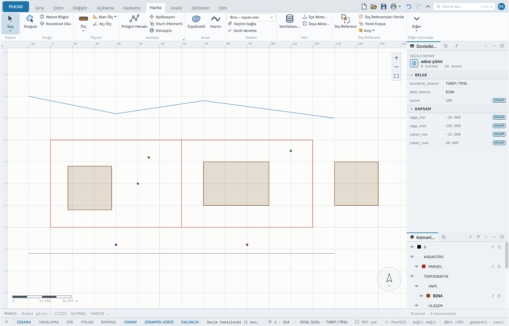
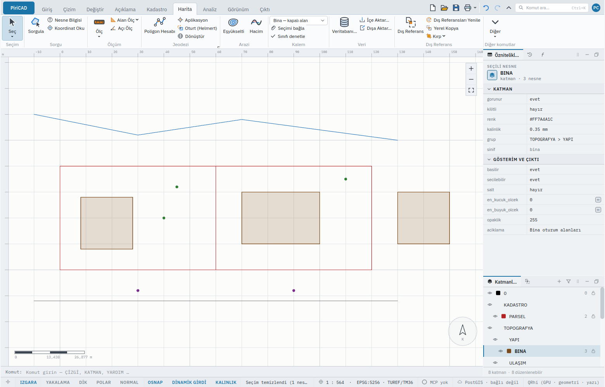

# KALEM — Sayısallaştırma Kalemi

Bir paftayı sayısallaştıran herkes için: "şimdi bir **bina** çiziyorum" demek, katmanı, sütunları
ve başlangıç değerlerini tek tek kurmaktan çok daha doğrudur. Bu sayfayı bitirdiğinizde bir sınıfı
seçip çizmeyi, çizdiğiniz nesnenin neden anlamlı bir GIS kaydı olduğunu ve sınıfa uymayan bir
şeklin neden reddedildiğini bileceksiniz.

## Ne yapar

`KALEM`, bir **sayısallaştırma sınıfını** (kalemi) seçer. Sınıf; bir geometri türünü (nokta,
açık çizgi, kapalı alan), bir katmanı, sınıfın taşıdığı alanları ve başlangıç değerlerini,
gösterimini ve denetimlerini birlikte söyler. Sınıf tanımları bir **veri paketindedir**
([Kalem kataloğu](../veri/kalem-katalogu.md)): kurumunuzun listesi bir dosya kopyalamakla
değişir, program yeniden derlenmez.

**Argümansız `KALEM` sınıfları sayar** ve etkin olanı işaretler.

**Bir sınıf adıyla `KALEM` şunları kurar**, hepsi tek komutta:

1. Sınıfın **katmanı** — yoksa yaratılır; rengi, çizgi kalınlığı, alan dolgusu ve katman
   ağacındaki yeri sınıftan gelir. Zaten varsa rengine ve grubuna dokunulmaz.
2. Sınıfın **alanları** — belgede yoksa öznitelik sütunu olarak tanımlanır. Yalnız bu sınıfın
   taşıdığı alan o katmana özeldir; paketteki birkaç sınıfın taşıdığı alan (örneğin
   `sinif_kodu`) baştan projenin sütunudur.
3. **Katmanın sınıfı izlemesi** — katman hangi sınıfın hangi sürümünü izlediğini dosyada saklar.
4. **Etkin katman** — yeni nesneler oraya gider.

**Sonra çizdiğiniz her şey anlamlı bir kayıttır.** Sınıfın katmanına çizilen nesne, hangi komutla
çizilirse çizilsin, boş hücrelerine sınıfın başlangıç değerlerini alır ve sınıfın geometrisinde
olmak zorundadır. Bina sınıfında bir açık çizgi çizmek **reddedilir** ve komut bütünüyle geri
sarılır; çizimde hiçbir şey kalmaz. Bu kural katmanın kuralıdır, çizenin değil: fare, komut satırı,
betik ve yapay zekâ aynı sonucu bırakır.

Başlangıç değeri, boş bir hücreyi doldurur; yazılmış bir değerin üstüne yazmaz. Boş bırakılan
alan (başlangıç değeri olmayan) boş kalır, sıfır olmaz.

## Adlar

| Türkçe | Tür |
|---|---|
| `KALEM` | Türkçe, birincil |
| `SINIF` | Türkçe eşanlamlı |
| `KLM` | Kısaltma |
| `PEN`, `FEATURECLASS` | İngilizce karşılık |
| `core.feature_class` | Komut kimliği |

## Sözdizimi

```text
KALEM
KALEM <sınıf>
KALEM ad=<sınıf>
```

## Parametreler

| Parametre | Ne yapar |
|---|---|
| `ad` | Sınıfın kimliği, adı ya da kısaltması (`bina`, `Yol ekseni`, `BUILDING`, `PRS`); Türkçe büyük/küçük harf gözetilmez. Verilmezse sınıflar listelenir |

Sınıf listesi `core.kalem.katalog` ayarının gösterdiği pakettendir; varsayılanı PiriCAD'in
örnek paketidir. Kendi paketiniz için bkz. [Kalem kataloğu](../veri/kalem-katalogu.md).

## Örnekler

### Komut satırı

Sınıfları görün; etkin olan işaretlidir:

```
KALEM
```

```text
Sayısallaştırma sınıfları (piricad-ornek-kalemler 0.1.0):
  bina         Bina         kapalı alan  katman BINA
  yol_ekseni   Yol ekseni   açık çizgi   katman YOL_EKSENI
  parsel       Parsel       kapalı alan  katman PARSEL
  dere         Dere         açık çizgi   katman DERE
  direk        Direk        nokta        katman DIREK
  agac         Ağaç         nokta        katman AGAC
  cit          Çit          açık çizgi   katman CIT
Seçmek için: KALEM <sınıf>   (örnek: KALEM bina)
```

Bina kalemini alın ve bir bina çizin:

```
KALEM bina
ALAN noktalar=0,0 12,0 12,9 0,9
```

```text
Kalem: Bina — kapalı alan, katman BINA (yeni), 4 alan (4 yeni sütun)
  Başlangıç değerleri: sinif_kodu=BNA · kat_sayisi=1 · yapi_turu=Betonarme
  Şimdi çizdiğiniz her kapalı alan BINA katmanına gider ve bu değerlerle başlar; sınıfa uymayan şekil reddedilir.
```

Çizilen binanın hücreleri doludur: `sinif_kodu` `BNA`, `kat_sayisi` `1`, `yapi_turu`
`Betonarme`; `bina_no` boştur çünkü sınıfın onun için bir başlangıç değeri yoktur. Değeri her
zaman değiştirebilirsiniz:

```
ÖZNİTELİK kat_sayisi 1 4
```

Sınıfa uymayan şekil reddedilir. Aynı katmana bir açık çizgi çizmek:

```text
[hata] 'Bina' sınıfı kapalı alan ister (katman 'BINA'); çizilen nesne açık çizgi. Şekli sınıfa uydurun ya da başka bir sınıfı seçin (KALEM).
```

Başka bir sınıfa geçin ve onun şeklini çizin:

```
KALEM yol_ekseni
ÇİZGİ 0,20 40,20
```

Sınıf adı kısaltmayla da, İngilizcesiyle de bulunur:

```
KALEM BUILDING
```

### Arayüz

**Harita ▸ Kalem** panelindeki liste paketin sınıflarını sayar (`Bina — kapalı alan`, `Yol ekseni —
açık çizgi`, …). Birini seçmek `KALEM <sınıf>` komutunu gönderir; etkin katman bir sınıfı izliyorsa
liste onu gösterir, izlemiyorsa `Kalem seçin…` yazar. Listenin satırının üstünde durunca sınıfın
bir cümlelik açıklaması ve katmanı çıkar. Paket okunamıyorsa liste kapalıdır ve ipucu nedenini
söyler.



Paneldeki iki düğme aynı komut ailesindendir: **Seçimi bağla** ([KALEMBAĞLA](feature_class_bind.md))
ve **Sınıfı denetle** ([KALEMDENETİM](feature_class_check.md)). Katman panelinde bir sınıf
katmanını seçince özellik paneli `sinif` satırında katmanın hangi sınıfı izlediğini yazar.



Klavyeyle: komut satırına `KALEM bina` yazmak listeden seçmekle aynıdır; listeye **Tab** ile
gelinir, **Alt+↓** ile açılır, **↑/↓** ile gezilir, **Enter** ile seçilir.

### Betik

```json
{
  "ad": "Bina çiz",
  "komutlar": [
    { "cmd": "core.feature_class", "args": { "ad": "bina" } },
    { "cmd": "core.area", "args": { "noktalar": [[0,0],[12000,0],[12000,9000],[0,9000]] } }
  ]
}
```

## Geri alma

Tek adım. `KALEM` katmanın sınıfı izlemesini geri alır; yaratılmış katman ve tanımlanmış sütunlar
**yerinde kalır** — boş bir katman ve sütun bildirimi `GERİAL` ile geri alınmaz (bkz.
[SÜTUN](column.md)), çünkü satırlar sütunlara göre adreslenir. Sınıf katmanına çizilen nesne ve
başlangıç değerleri **tek adımdır**: `GERİAL` ikisini birlikte alır.

Bir betiğin ya da toplu işin içinde `KALEM`, başka bir katmana özel tanımlanmış bir sütunu
projeninki yapmak zorunda kalırsa reddedilir (geri alınamayacağı için); komutu betikten önce ayrıca
çalıştırın.

## Betikten kullanım

Komut kimliği `core.feature_class`; parametre `ad`. Python'dan `cad.feature_class(name="bina")`
olarak çağrılır. Yapılandırılmış sonuç:

| Alan | Ne |
|---|---|
| `sinif`, `ad` | Sınıfın kimliği ve adı |
| `paket` | `paket@sürüm` |
| `geometri` | `nokta`, `cizgi` ya da `alan` |
| `katman`, `yeni_katman` | Katmanın adı ve bu komutla yaratılıp yaratılmadığı |
| `katmandaki_nesne` | Sınıfı izlemeyen mevcut bir katmanı devralırsa, üzerindeki nesne sayısı (denetlenmediler) |
| `alanlar` | Her alan için `kimlik`, `tur`, `varsayilan` ve sütunun durumu: `yeni`, `var` ya da `ortak` |

Argümansızken sonuç `paket` ve `siniflar` (her biri için `sinif`, `ad`, `geometri`, `katman`,
`etkin`) taşır.

Yapay zekâ bu komutu çağırabilir; çizdiği her nesne gibi bu da önizlenir ve onaylanır.

## Hatalar

| Mesaj | Sebep | Çözüm |
|---|---|---|
| `Bilinmeyen sınıf: '<ad>'. Tanımlı sınıflar: … Listeyi görmek için argümansız KALEM yazın.` | Sınıf paketde yok | Listedeki bir kimliği yazın |
| `Kalem kataloğu bulunamadı: '<yol>'. Kurulumda eksikse PIRICAD_DATA ile dizini gösterin.` | `core.kalem.katalog` bir dosya göstermiyor | Ayarı düzeltin ([Kalem kataloğu](../veri/kalem-katalogu.md)) |
| `'<yol>' geçerli JSON değil: …` ya da `'<yol>' sınıf '<id>' …` | Paket okunamıyor ya da bir tanım çalışmıyor | Mesajdaki sınıfı ve alanı düzeltin; paket yüklenmeden hiçbir şey yapılmaz |
| `'<katman>' katmanı zaten '<sınıf>' sınıfını izliyor. '<ad>' sınıfı bu katmanı kullanıyor; …` | Katman başka bir sınıfa (ya da başka bir paketin sınıfına) bağlı | Önce ötekini bırakın ya da paketinizde katman adını değiştirin |
| `'<sütun>' sütunu belgede <tür>, '<ad>' sınıfı onu <tür> ister. Sütunun türü değişmez; …` | Belgede aynı adda, başka türde bir sütun var | Paketinizde alanın kimliğini değiştirin ya da belgedeki sütunu başka adla yeniden tanımlayın |
| `'<ad>' sınıfı başka bir katmanın sütununu ortak yapacak; bu değişiklik bir betiğin ya da toplu işin içinde geri alınamaz. …` | Betik içinde, başka katmana özel bir sütunun kapsamı genişletilecek | `KALEM`'i betikten önce ayrıca çalıştırın |
| `'<ad>' sınıfı <geometri> ister (katman '<katman>'); çizilen nesne <geometri>. Şekli sınıfa uydurun ya da başka bir sınıfı seçin (KALEM).` | Sınıf katmanına geometrisi uymayan nesne çizildi ya da taşındı | Şekli sınıfa uydurun ya da başka sınıfı seçin; komut geri sarıldı |

## İlgili

- [Kalemle sayısallaştırma](../baslangic/kalemle-sayisallastirma.md) — baştan sona bir pafta
- [KALEMBAĞLA](feature_class_bind.md) — var olan CAD nesnelerini sınıfa bağlar
- [KALEMDENETİM](feature_class_check.md) — nesnelerin hâlâ sınıfın dediği gibi olup olmadığına bakar
- [Kalem kataloğu](../veri/kalem-katalogu.md) — kurumunuzun sınıflarını yazma
- [KATMAN](layer.md), [SÜTUN](column.md), [ÖZNİTELİK](attribute.md)
