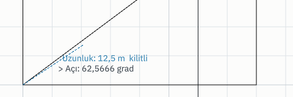
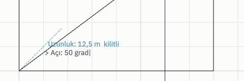
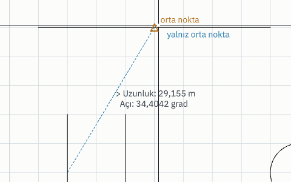

# Komut Satırı

Klavyeden hızlı çalışmak isteyen kullanıcı için; bu sayfayı bitirdiğinizde koordinatı
dört ayrı biçimde girebilecek, satır içi hesap yapabilecek ve hata mesajlarını
çözebileceksiniz.

Komut satırı harita alanının hemen altındadır ve **her zaman açıktır**; **Ctrl+9** ile ya da
**Görünüm ▸ Pencereler ▸ Paneller ▸ Komut Satırı** ile gizlenir, aynı yolla geri gelir. Geri
geldiğinde odak doğrudan oraya gelir.

## Komut çağırmak

Komut adını yazıp **Enter**'a basın:

```
YARDIM
```

Adı yazarken satır içi tamamlama önerir. Türkçe adı, İngilizce karşılığını, kısaltmasını
veya komut kimliğini yazabilirsiniz — hepsi aynı komuta gider:

```text
ÇİZGİ        CIZGI        LINE        Ç        L        core.line
```

Büyük/küçük harf farkı yoktur; dönüşüm Türkçe kurallarına göre yapılır, yani `çizgi`
doğru şekilde `ÇİZGİ` olur.

### Bir komut sözcük sorduğunda

Bir komut bir **sözcük** sorduğunda — bir katman adı, bir renk, bir işlem — soru
satırda yazılı durur ve komutun bildiği cevaplar satırın üstünde bir **liste** olarak
açılır. Birine **tıklamak** cevaptır; yazmaya başlamak listeyi daraltır, ok tuşları
listede gezer ve Enter seçer. Renk adlarının yanında renk örneği vardır.

Böyle bir soruda tuvale tıklamak bir cevap değildir: komut soruyu açık tutar ve
cevabın yazılması ya da listeden seçilmesi gerektiğini söyler.

## Koordinat girmek

Beş biçim vardır. Hepsi hem komut argümanı olarak hem de bir komut nokta beklerken
kullanılabilir.

### Mutlak koordinat

```
485320.150,4310220.400
```

Metre cinsinden, dokümanın koordinat sisteminde. Ondalık ayırıcı **noktadır**, virgül X
ile Y'yi ayırır. Boşluk kullanmayın.

### Göreli koordinat

```
@50,30
```

Bir önceki noktadan 50 metre doğu, 30 metre kuzey. Negatif değer ters yöne gider:
`@-25,0` yirmi beş metre batı.

### Kutupsal koordinat

```
@100<45
```

Bir önceki noktadan **45 grad** yönünde 100 metre. Açı, arazide aletin okuduğu gibi
**semt açısıdır**: kuzeyden başlar, saat yönünde artar ve varsayılan birimi **grad**'dır
(tam daire 400): `0` kuzey, `100` doğu, `200` güney, `300` batı. `@100<45` bu yüzden
kuzeydoğuya, kuzeye daha yakın bir doğrultuya (40,5°) gider.

Birimi tek bir koordinat için açıya **sonek** ekleyerek söylersiniz. Sonek büyük ya da
küçük harf olabilir ve parantezli bir ifadeden sonra da yazılır (`@100<(40+5)g`):

| Sonek | Birim | Örnek | Anlamı |
|---|---|---|---|
| `g` | grad | `@100<45g` | 45 grad |
| `d` | derece | `@100<45d` | 45 derece |
| `r` | radyan | `@100<0.7r` | 0,7 radyan |

Soneksiz bir açı `açı_birimi` proje ayarıyla okunur (`AYAR açı_birimi derece`). Açının
nereden başlayıp hangi yöne arttığını ise `açı_kuralı` oturum modu söyler; kısa adı
`kural`. **Matematik kuralına** — açı doğudan başlar, saat yönünün tersine artar — şöyle
geçilir:

```
MOD kural matematik
```

Bu kuralda `@100<0` doğuya, `@100<100` (grad) kuzeye gider. Önceki sürümlerin anlamı —
derece, doğudan saat yönünün tersine — şu iki satırla geri gelir:

```
MOD kural matematik
AYAR açı_birimi derece
```

Semt kuralına ve grada dönmek için modu ve ayarı varsayılanına alın:

```
MOD kural varsayilan
AYAR açı_birimi varsayilan
```

Kural ve birim yalnız **yazdığınız metni** etkiler — komut satırını, betik dizesini ve
yapay zekâ önerisini. Komut günlüğü çözülmüş koordinatı (milimetre) tutar; bu yüzden eski
bir günlük ya da betik hangi ayarla oynatılırsa oynatılsın aynı çizimi verir. `ÖLÇ`,
`APLİKASYON` ve sürüklerken kılavuz üzerinde okunan açı da aynı iki ayarla yazılır.
Ayrıntı: [Oturum modları](mode.md).

### Satır içi ifade

Koordinatın herhangi bir bileşeni parantezli bir hesap olabilir:

```
@(100*3),0
@(45.5+12.25),(80/2)
```

Böylece hesap makinesi açmadan koordinat üretirsiniz.

### Nokta fonksiyonu

```
orta(485320,4310220,485370,4310250)
```

Koordinatı **hesaplatmak** yerine **tarif etmek**: iki noktanın ortası, bir doğruya
indirilen dik, iki doğrultunun kesişimi. Kâğıt üzerinde yaptığınız inşa, koordinatın
yazıldığı her yere yazılır. Ayrıntı ve bütün liste: [Nokta fonksiyonları](#nokta-fonksiyonları).

### Hepsi bir arada

```
ÇİZGİ 485320.150,4310220.400 @50,30 @100<45 @(100*3),0 @80<90d orta(son,@50,0)
```

### İmleç yanında uzunluk ve açı: dinamik girdi

Bir çizgiyi, sonraki noktayı beklerken sürüklüyorsanız (ÇİZGİ, ÇOKLUÇİZGİ, TAŞI…) imlecin
yanında iki alan görünür: **Uzunluk** ve **Açı**. Hangisini söylemek istiyorsanız yazarsınız;
öbürünü fare belirlemeye devam eder. Alanlar **DİNAMİK GİRDİ** anahtarına bağlıdır
(durum çubuğu; kapalıysa yalnız eski okuma kalır).

| Siz | Olan |
|---|---|
| `12.5` yazıp **Enter** | İmlecin gösterdiği yönde 12,5 m ilerleyen nokta (**doğrudan mesafe girişi**). `12,5` virgüllü ise koordinattır, mesafe değil |
| `12.5` yazıp **Tab** | Uzunluk **kilitlenir** (satır boşalır, imlecin yanında "kilitli" yazar); fareyi nereye oynatırsanız oynatın nokta 12,5 m uzakta kalır, yön fareyi izler |
| Uzunluk kilitliyken `50` yazıp **Enter** | Nokta tam olarak `@12.5<50` yazmışsınız gibi: 12,5 m, 50 grad |
| Yalnız açıyı kilitlemek için **Tab** (boş satırda), `50`, **Tab** | Açı kilitli, uzunluk fareninki |
| Boş satırda **Tab** | Alan değiştirir; kilitli bir alana geçerseniz değeri satıra geri gelir, kilidi kalkar, düzeltirsiniz |
| **Esc** | Önce kilitleri kaldırır; ikinci Esc komutu bırakır |
| Fareyle **tıklamak** | Kilitliyse nokta kilitli değere oturur: tıkladığınız yer yalnız serbest alanı belirler |





Uzunluk birimli de yazılır (`1250 cm`, `12.5 m`, `(2m+50cm)`; bkz. [Birimli sayılar](#birimli-sayılar)),
açı oturumun birim ve kuralıyla (`45`, `45d`, `100g`, `0.7r`) yazılır. Kilitlediğiniz değer
tuşlara bastığınız anda doğrulanır; geçersizse (`0`, `abc`, `45zz`) neden söylenir, kilitlenmez.

**Yazdığınız satır aynı satırdır.** Enter, alanları `@12.5<50` gibi yazılabilir bir satıra
çevirir ve onu yazmışsınız gibi çalıştırır; transkriptte `Nokta: @12.5<50` görürsünüz,
günlükte ve betikte nokta olarak yer alır. Kilit günlüğe girmez; yalnız çıkan nokta girer.
Fareyle yönü veren bir alan varsa o kısım milimetreye (uzunluk) ve mikro dereceye (açı)
kadar tam yazılır, yani kilitli uzunlukla tıklamak ile aynı uzunluğu elle yazmak aynı noktadır.

### Geçici nesne yakalama: yalnız bir sonraki nokta için

Sürekli açık yakalamalar (uç, orta, kesişim…) çalışırken bir noktayı tek bir yakalama ile
almak istediğinizde, nokta beklenirken yakalamanın **adını** yazıp Enter'a basın:

```text
ÇİZGİ
60,10                      ← ilk nokta
orta                       ← Enter — "Geçici yakalama: orta nokta — yalnız bir sonraki nokta için."
                           ← şimdi bir çizginin ortasına yakın bir yere tıklayın
```



Yazılan yakalama, sürekli açık olan nesne yakalamaların **yerine** geçer ve yalnız bir sonraki
nişanlanan nokta için geçerlidir; o nokta alınınca ya da sonraki soruya geçilince biter. **Esc**
bekleyen geçici yakalamayı kaldırır (ikinci Esc komutu bırakır). Dik mod, kutupsal izleme ve ızgara
olduğu gibi kalır. İmlecin yanında "yalnız orta nokta" yazar; yakınında o türde bir nokta yoksa
nokta olduğu yerde kalır.

| Yazılan | Yakalama |
|---|---|
| `uç`, `uç nokta`, `END` | Uç nokta |
| `orta`, `orta nokta`, `MID` | Orta nokta |
| `merkez`, `CEN` | Dairenin/yayın merkezi |
| `ağırlık merkezi` | Kapalı halkanın ağırlık merkezi |
| `kesişim`, `INT` | İki çizginin kesişimi |
| `dik`, `dik ayak`, `PER` | Son noktadan dik ayak |
| `yakın`, `en yakın`, `NEA` | En yakın nokta |
| `düğüm`, `NOD` | Ölçü noktası |
| `çeyrek`, `QUA` | Dairenin dört çeyrek noktası |
| `teğet`, `TAN` | Son noktadan teğet ayağı |
| `uzantı`, `EXT` · `paralel`, `PAR` · `uzatılmış kesişim`, `APP` | Kurulan noktalar |
| `ekleme`, `INS` | Ekleme noktası |

Sözcükler yakalama kipinin kendi adlarıdır (büyük/küçük harf ve Türkçe harf farkı gözetilmez).
Bir komutun da adı olan bir sözcük (`KES` gibi) komut olarak çalışır; yakalama için tam adı
(`kesişim`) yazın. Yakalama günlüğe girmez: günlükte yalnız çıkan nokta yazılır, yani aynı çizim
betikte o noktanın koordinatıyla yapılır.

## Nokta fonksiyonları

Bir nokta yerine **onu nasıl bulduğunuzu** yazarsınız. Fonksiyon, komut çalışmadan
önce tek bir koordinata çözülür: komut çözülmüş noktayı görür, komut günlüğü de onu
tutar. Bu yüzden nokta fonksiyonu komut satırında, betikte ve çalışan bir komutun
istemine yazdığınız yanıtta aynı şeydir — üçü de aynı gramerden geçer.

```
ÇİZGİ orta(0,0,100,0) dik(0,0,100,0,30,-5)
```

### Bütün fonksiyonlar

| Yazım | Ne verir |
|---|---|
| `son` | Bir önceki nokta. Yalnız argüman içinde; tek başına `son()` ya da `@0,0` yazın |
| `n(1284)` | Çizimdeki 1284 numaralı ölçü noktası |
| `orta(A,B)` | A ile B'nin tam ortası |
| `ile(P,@dx,dy)` · `ile(P,@d<a)` | P'den ölçülen göreli nokta |
| `dik(A,B,ayak,boy)` | AB doğrultusunda A'dan `ayak` metre, oradan `boy` metre dik |
| `semt(S,açı,kenar)` | S istasyonundan `açı` semtinde `kenar` metre |
| `kes(A,açı1,B,açı2)` | A'dan ve B'den çıkan iki **doğrultunun** kesişimi |
| `kes(A,r1,B,r2,yön)` | A'ya `r1`, B'ye `r2` metre olan nokta — iki çözüm, `yön` seçer |
| `kes(A,B,C,D)` | AB **doğrusu** ile CD doğrusunun kesişimi |
| `ara(A,B,oran)` · `ara(A,B,mesafe m)` | AB üzerinde oranla ya da metreyle |
| `uzanti(A,B,mesafe)` | AB doğrultusunda B'den `mesafe` metre öte |
| `xy(P,Q)` | P'nin sağa değeri, Q'nun yukarı değeri |
| `boyunca(nesne(k),mesafe,sapma)` · `boyunca(nesne(k),mesafe)` | `k` kimlikli çizgi, çoklu çizgi, yay, daire ya da yaylı çizgi boyunca, ilk noktasından `mesafe` metre; oradan `sapma` metre yana (sağ pozitif) |

Adlar büyük/küçük harf ve noktalı/noktasız i farkı gözetmez: `ORTA`, `orta`,
`uzantı` ve `uzanti` aynı fonksiyondur.

Bir komut nokta beklerken şeritteki **Nokta Girişi** sekmesinde her fonksiyon bir
düğmedir: düğme fonksiyonu satıra başlatır, tuvaldeki tıklamalar noktalarını yazar
([Soru sürerken: Nokta Girişi sekmesi](../baslangic/arayuz.md#soru-sürerken-nokta-girişi-sekmesi)).

### Argüman yazmanın kuralı

Argümanlar virgülle ayrılır — ve **koordinat da virgülle yazılır**. Bu yüzden bir
nokta argümanı mutlak yazıldığında **iki** argüman yeri harcar:

```
orta(0,0,100,0)           iki nokta: (0,0) ve (100,0)
dik(0,0,100,0,30,-5)      iki nokta, sonra iki sayı: ayak 30, boy −5
```

Bir nokta argümanı tek yer harcayan biçimlerde de yazılabilir — kutupsal, `son`, ya da
başka bir fonksiyon:

```
orta(son,@100<50)
dik(n(1284),n(1285),12.5,3)
orta(orta(0,0,100,0),orta(0,100,100,100))
```

Bir argüman **sayı** ise satır içi ifade olabilir (`(40+5)`), **açı** ise `g`, `d`, `r`
sonekini alır (`semt(0,0,45g,100)`) ve soneksizse `açı_birimi` ile `açı_kuralı`
ayarlarından okunur — kutupsal koordinatla tıpatıp aynı kural.

`ile`'nin ikinci argümanı `@` ile başlamak zorundadır: ölçüm P'den yapılır ve mutlak
bir çift verilseydi P sessizce boşa giderdi.

### Bir nesne boyunca: `boyunca` ve `nesne`

`boyunca(nesne(k),mesafe,sapma)` bir nesnenin **üzerinde yürür**: `k` kimlikli nesnenin
ilk noktasından, çizildiği yönde, `mesafe` metre ilerler — yayda ve dairede eğrinin
kendisi boyunca, kirişleri boyunca değil — ve oradan `sapma` metre yana çıkar. Sapma
`dik()`'in kuralıyla **sağ pozitiftir**: saat yönünün tersine çizilmiş bir yayda sağ,
dışarısıdır. Netcad'in Obje Üzerinde ve Paralel Nokta hesabının karşılığıdır.

`nesne(k)` bir **nesnedir, nokta değil**: yalnız `boyunca`'nın ilk argümanı olarak
yazılır; kimliği `NESNEBİLGİ` ya da seçim satırı söyler. 20 m yarıçaplı bir yayda,
yay boyunca 25 m ve 3 m sağda bir nokta:

<!-- örnek: yeni çizim -->
```
YAY merkez=0,0 baslangic=20,0 bitis=-20,0
NOKTA boyunca(nesne(1),25,3)
```

Nokta yayın merkezinden 23 m uzakta, 7,252 m sağa ve 21,827 m yukarıya düşer —
25/20 radyanlık açının kosinüsü ve sinüsüyle aynı milimetre.

### Dik ayak ve dik boy — işaret kuralı

`dik(A,B,ayak,boy)`, A'dan B'ye **yürürken** düşünülür: `ayak` bu yönde kaç metre
gidildiği, `boy` oradan kaç metre yana çıkıldığıdır. **Sağ pozitif, sol negatiftir** —
Netcad'in Yan Nokta Hesabı, Bina Oluştur ve enkesitlerle aynı kural. Netcad'de ölçülmüş
bir dik boy burada olduğu gibi yazılır.

> **29 Eylül 2026'dan önce yazılmış betikler için:** bu kural o güne kadar sol pozitifti.
> Eski bir betikteki `dik(...)` ya da `DİKAYAK boy=` değerlerinin işaretini çevirin.
> Günlükler ve kaydedilmiş çizimler etkilenmez: günlük hesabı değil, bulunan noktayı tutar.

```
ÇİZGİ dik(0,0,100,0,30,5) dik(0,0,100,0,30,-5)
```

Taban `0,0` → `100,0`, yani doğu. Doğuya yürürken sağ el güneyi gösterir, bu yüzden
ilk nokta `(30, −5)`, ikincisi `(30, 5)` olur.

Bir ölçü krokisindeki cephe alımı tek satırdır — taban bir kez yazılır, cepheye ait
ayak/boy çiftleri sırayla gelir:

```
ÇOKLUÇİZGİ dik(0,0,40,0,0,0) dik(0,0,40,0,12.4,3.1) dik(0,0,40,0,27.8,3.1) dik(0,0,40,0,40,0)
```

Gerçek bir krokide taban iki ölçü noktasıdır; `0,0` ve `40,0` yerine `n(1)` ve `n(2)`
yazarsınız. Aynı işi fareyle ve tek tek sorarak [`DİKAYAK`](perp_offset.md) yapar; işaret
kuralı aynıdır. Bir binanın **derinliği** de aynı kuralla işaretlenir:
[`DİKDÖRTGEN yontem=derinlik`](rectangle.md) `derinlik=6`'yı kenarın sağına, `derinlik=-6`'yı
soluna kurar.

### İki mesafe kesişimi — iki çözüm vardır

İki bilinen noktadan şeritle ölçülmüş iki mesafe **iki** noktada kesişir: doğrunun
solundaki ve sağındaki. Program kendiliğinden birini seçmez; hangisi olduğunu
söylersiniz:

```
NOKTA kes(0,0,60,100,0,80,sol) kes(0,0,60,100,0,80,sağ) kes(0,0,60,100,0,80,yon=40,40)
```

Sırasıyla `(36, 48)`, `(36, −48)` ve yine `(36, 48)` — sonuncusunda çözümü yönle değil,
aradığınıza yakın bir noktayla seçtiniz.

`sol` ve `sağ`, A'dan B'ye bakarken hangi el tarafı olduğunu söyler. Yakın bir nokta
verecekseniz **`yon=` ile yazmak zorundasınız**: çıplak bir koordinat orada
`kes(A,B,C,D)` okumasından ayırt edilemez ve program iki okumadan birini sessizce
seçmez. Çemberler birbirine ulaşmıyorsa hata iki yarıçapı ve merkezler arası mesafeyi
birlikte yazar, böylece hangi ölçünün yanlış olduğunu görürsünüz.

### Çizim örnekleri

Ölçü listesini okuduktan sonra noktalarınıza numarasıyla ulaşırsınız:

```
NOKTALAR dosya="olcu.txt"
```

```
ÇİZGİ n(1284) n(1285)                        ← iki ölçü noktası arasına
ÇİZGİ orta(n(1),n(2)) @0,25                  ← kenar ortasından kuzeye 25 m
ÇİZGİ kes(n(1),n(2),n(3),n(4)) @10<0         ← iki cephe hattının köşesinden
NOKTA semt(n(10),128.4560,62.317)            ← istasyondan semt ve kenar
NOKTA kes(n(1),34.28,n(2),51.06,sol)         ← iki şerit ölçüsünden
NOKTA ara(n(1),n(2),0.5) ara(n(1),n(2),12 m) ← kenar üzerinde oran ve metre
```

Aynı inşalar numarasız da yazılır; `n(...)` yerine koordinatı, `son`'u ya da başka bir
fonksiyonu koyabilirsiniz:

```
ÇİZGİ 10,20 orta(son,@40,0) kes(0,0,100,100,0,100,100,0) uzanti(0,0,30,40,25)
```

## İfade değerlendirici

Parantez içinde ve sayı beklenen her yerde çalışır.

| İşleç | Anlamı | Örnek |
|---|---|---|
| `+` `-` | Toplama, çıkarma | `(100+50)` |
| `*` `/` | Çarpma, bölme | `(100*3)` |
| `%` | Kalan | `(100%30)` |
| `^` | Üs | `(2^10)` |
| `( )` | Gruplama | `((2+3)*4)` |
| `-` (önek) | Negatif | `(-5+2)` |

Öncelik matematikteki gibidir: `(2+3*4)` sonucu `14`, `((2+3)*4)` sonucu `20`. Üs
sağdan birleşir: `(2^3^2)` sonucu `512`.

Ondalık ayırıcı her zaman noktadır ve makinenin bölge ayarından etkilenmez.

### Birimli sayılar

Uzunluk isteyen her yere sayıyı birimiyle yazabilirsiniz: `mm`, `cm`, `dm`, `m`, `km`.
Birim sayıya bitişik ya da bir boşlukla ayrı yazılır, büyük küçük harf fark etmez. Aşağıdaki
yedi satır aynı komuttur; `mesafe` milimetredir, yani hepsi `mesafe=1000` yazar:

```text
OFSET nesneler=1 mesafe=1000
OFSET nesneler=1 mesafe=1m
OFSET nesneler=1 mesafe=1 m
OFSET nesneler=1 mesafe=100cm
OFSET nesneler=1 mesafe=1000mm
OFSET nesneler=1 mesafe=(50cm+500mm)
OFSET nesneler=1 mesafe="1 m"
```

Değer, parametrenin **bildirdiği birime** çevrilir: metre isteyen bir parametrede `1250cm`
12.5, milimetre isteyen birinde 12500 olur. Çevrilen değer günlüğe ve betiğe düz sayı olarak
yazılır; yani bir komutun kaydı hangi yazımla verildiğinden bağımsızdır ve tekrar oynatmak
için birim bilmek gerekmez. Aynı büyüklüğün farklı yazımları **bire bir aynı sayıdır**
(`125.3mm` ile `0.1253 m` aynı sayıdır): birim, yazdığınız ondalık sayının üssünü kaydırır,
bir sabitle çarpmaz.

| Yazdığınız | Sonuç |
|---|---|
| `12.5 m`, `1250 cm`, `12500mm`, `0.0125km` | aynı uzunluk |
| `(2m+50cm)` | 2.5 m |
| `(3m*2)`, `(10m/4)` | 6 m, 2.5 m |
| `(10m/50cm)` | 20 (iki uzunluğun oranı birimsizdir) |
| `1250cm,3000cm`, `@50cm,2m`, `@1250cm<45` | koordinat bileşenleri; her zaman metre |
| `(2m+50)` | **hata**: uzunluğa birimsiz sayı eklenmez, birimi her sayıya yazın |
| `(2m*3m)` | **hata**: alan birimi desteklenmez |
| `5xyz` | **hata**: bilinmeyen birim `xyz` |
| `sayi=5m` | **hata**: `sayi` bir uzunluk değil, birimsiz yazın |

Açılar birim almaz (`@100<45g`'deki `g` grad'dır, uzunluk değil). Bir komutun hangi parametresinin
uzunluk olduğu, [komut referansında](referans.md) parametrenin yanındaki `[m]` ya da `[mm]`
işaretidir; işareti olmayan parametre bir uzunluk değildir ya da birimini henüz bildirmemiştir
ve birimli sayıyı adıyla reddeder. Metin isteyen bir parametre yazdığınızı olduğu gibi tutar:
`KATMAN ad=10m` adı `10m` olan bir katman açar.

Bir sayı **sorulduğunda** (komut size `Paralel mesafesi (metre)` ya da `Yarıçap (m)` sorarken)
aynı yazımlar geçerlidir ve **sorunun parantez içinde söylediği birime** çevrilir: `5 m`,
`500 cm`, `5000mm` ve `(4m+100cm)` aynı cevaptır. Bu, aynı parametrenin satırdaki birimiyle aynı
olmak zorunda değildir: `OFSET`'in satırdaki `mesafe=` milimetredir ama istemi metre sorar, ve
her ikisinde de `1 m` bir metredir. Uzunluk sormayan bir istemde (adet, açı, ölçek) birim
yazarsanız komut "bu istem birimli sayı almıyor" der ve soruyu açık tutar.

Tek bir sayı soran istemde ondalık ayırıcı **virgül** de olabilir: `12,5` 12.5'tur, `1.250,5` ve
`1,250.5` 1250.5'tur (sonda olan ayraç ondalıktır). İki sınır var:

- Komut satırında `12,5` hâlâ bir koordinattır.
- Tuvale tıklayarak da cevaplanan mesafe istemlerinde (Ofset mesafesi, yarıçap…) **tek başına**
  yazılan `a,b` hâlâ bir koordinattır: cevap, o noktaya olan uzaklıktır. Orada ondalık için nokta
  kullanın ya da birim ekleyin (`5,5 m` bir koordinat değil, beş buçuk metredir).

Boşluklu birimde (`12.5 m`) birim bir önceki sayıya aittir; koordinatın içinde bitişik yazın:
`12.5m,30`.

Ondalık nokta kuralı değişmedi, ama bir sayı artık sessizce kesilmez: `1.2.3` eskiden 1.2
okunup gerisi atılıyordu, şimdi sayı değildir ve bir ad ya da tarih olarak kalır
(`ÖZNİTELİK tarih 2026.10.03`).

## Anahtar=değer argümanları

Parametreleri adıyla verebilirsiniz; sıra önemli değildir:

```
KATMAN ad=PARSEL gorunur=evet kilitli=hayır renk=4281236786
YAKINLAŞ mod=ÇARPAN carpan=1.5
```

Evet/hayır değerleri için `evet`, `hayır`, `yes`, `no`, `true`, `false`, `1`, `0`
kabul edilir.

**Bir nokta listesinin anahtarı, ardından gelen koordinatları da toplar.** Birden çok
nokta alan bir parametrenin adını bir kez yazmanız yeter; arkasından boşlukla
yazdığınız her koordinat o listeye eklenir:

```text
ALANÖLÇ noktalar=0,0 20,0 20,10 0,10
KOPYALA baslangic=0,0 bitis=20,0 40,0 60,0
```

Liste, koordinat olmayan ilk değerde ya da başka bir anahtarda biter. Nesne kimliği
gibi başka listelerde anahtarı yinelersiniz: `SİL nesneler=1 nesneler=2`.

İçinde boşluk olan metin tırnak içine alınır:

```
KATMAN ad="YOL KENARI"
```

Hangi komutun hangi parametreleri aldığını [komut referansından](referans.md) veya
program içinden görebilirsiniz:

```
YARDIM komut=KATMAN
```

## Çalışan komuta değer vermek

Bir komut `İlk nokta` gibi bir istek gösterirken haritaya tıklayabilir **veya** komut
satırına koordinat yazabilirsiniz. İkisi de aynı kapıya çıkar:

```
ÇİZGİ                          ← Enter, komut nokta istemeye başlar
485320.150,4310220.400         ← Enter
@50,30                         ← Enter
@100<45                        ← Enter
                               ← Esc, komut biter
```

Komut çalışırken şeffaf bir komut yazarsanız (`YAKINLAŞ` ya da `MOD` gibi) araya girer,
görünümü ya da modu değiştirir ve çalışan komut kaldığı yerden devam eder.

**Son noktayı geri almak.** `ÇİZGİ`, `ÇOKLUÇİZGİ`, `ALAN` ya da `SPLINE` bir sonraki noktayı
beklerken `G` yazıp Enter'a basarsanız yalnız son nokta geri alınır ve komut onu yeniden
ister; `GERİ`, `U` ve `GERİAL` de bu istemde aynı şeyi yapar. Boş satırda **⌫** da
aynıdır:

```
ÇİZGİ                          ← Enter
0,0                            ← Enter
10,0                           ← Enter
99,99                          ← Enter — yanlış nokta
G                              ← Enter — 99,99 geri alındı, çizgi 10,0'dan devam eder
10,10                          ← Enter
                               ← Enter, iki çizgi yazılır
```

**İstemin kendi seçenekleri.** Bazı istemler bir noktanın yerine geçen bir sözcük de alır;
istem metni bunu söyler (`… K: kapat`). Şimdilik `ÇİZGİ`, `ÇOKLUÇİZGİ`, `ALAN` ve `SPLINE` sonraki noktayı
beklerken **`K`** (`KAPAT`, `CLOSE`) yazılabilir: çalışma ilk noktaya kapanır ve biter;
`SPLINE`'da eğri kapanır (`kapali=evet`), `ALAN`'da halka biter (Enter ile aynı). Şeritte aynı
iş **Nokta Girişi ▸ Seçenekler ▸ Kapat** düğmesidir. Sözcük
tek başına bir satır olmalıdır — `K 1,2` bir koordinat çiftidir, kapatma değil — ve komut
adlarından önce bakılır; `C` bu istemde ayrılmamıştır, çünkü `Ç` zaten `ÇİZGİ`nin adıdır.
Seçenek günlüğe girmez: `ÇİZGİ` ve `ÇOKLUÇİZGİ`'de kapatma ilk noktanın bir kez daha verilmesi olarak
yazılır, yani `ÇOKLUÇİZGİ 0,0 10,0 10,10 0,0` yazmakla aynı çizimi ve aynı günlük satırını verir;
`SPLINE`'da `kapali=evet` olarak yazılır.

**Yazdığınız koordinat yazdığınız yere düşer.** Nesne yakalama, ızgara, dik mod, kutupsal
izleme ve iz yalnız **fareyle nişan aldığınız** noktaya uygulanır. Komut satırına yazılan,
komutla birlikte verilen (`ÇİZGİ 0,0 10,0 10,10`), betikte yazılan ya da bir yapay zekâ
önerisinde gelen koordinat kesin bir değerdir ve hiçbir yardımcı onu değiştirmez. Yakalama
açıklığı ekran pikselidir; bir köşeye on beş santimetre kala yazılan `485320.150` o köşeye
çekilseydi, yakınlaştırma düzeyi bir tapu koordinatına karar vermiş olurdu.

Bir köşeyi yazarak almak istiyorsanız köşenin kendisini yazın ya da tıklayın.

### Çizimin katmanı: `katman=`

Çizim komutları — `ÇİZGİ`, `ÇOKLUÇİZGİ`, `ALAN`, `DAİRE`, `YAY`, `ELİPS`, `DİKDÖRTGEN`,
`ÇOKGEN`, `SPLINE`, `NOKTA`, `METİN`, `TARAMA`, `DİLİM`, `HALKA`, `DİKAYAK`, `ALIM`, `ÇİFTÇİZGİ`,
`KESİŞİMNOKTA`, `ARANOKTA`, `BÖLÜMLE`, `DÖRDÜNCÜKÖŞE`, `ÖLÇÜ`, `LİDER`, `SINIR` ve `BLOKEKLE` — `katman=`
alır: çizdikleri o katmana gider, **etkin katman değişmez**. Katman adıyla verilir, büyük
küçük harf ayrımı yoktur ve yalnız adıyla yazılır; satırın sonunda kalan adsız bir sözcük
katman sayılmaz.

<!-- örnek: yeni çizim -->
```
KATMAN ad=YOL
KATMAN ad=PARSEL
ÇİZGİ katman=YOL 0,0 40,0
ALAN 0,0 20,0 20,10 0,10
```

Çizgi YOL'a, alan etkin katman PARSEL'e gider.

**Komut soru sorarken de verilir.** Bir sonraki noktayı beklerken `katman=YOL` yazıp
Enter'a basarsanız komut sormayı sürdürür ve o çalıştırmada çizdikleri YOL'a gider:

```text
ÇİZGİ                          ← Enter
0,0                            ← Enter
katman=YOL                     ← Enter — Bu komutun çizdikleri 'YOL' katmanına gider; etkin katman değişmez.
40,0                           ← Enter
                               ← Esc, çizgi YOL'a yazılır
```

Günlüğe ilk satırda verilmiş gibi yazılır: `ÇİZGİ katman=YOL 0,0 40,0`. **Nokta Girişi**
sekmesindeki **Katmanı nesneden al** bunu fareyle yapar: basıp bir nesneye tıklayın, o
nesnenin katmanı aynı satırla verilir (Netcad'de çizimin tıklanan nesnenin katmanına
gitmesi). Çizimde olmayan bir katman reddedilir; önce `KATMAN ad=…` ile oluşturun.

## Son komutu yinelemek

Hiçbir komut çalışmıyorken **boş** komut satırında **Enter**'a ya da **Boşluk**'a basmak
son komutu yeniden başlatır. Komut **yöntemiyle** gelir, noktalarıyla gelmez:

```
DAİRE yontem=3n                ← Enter, üç nokta ister
                               ← …üç nokta verildi, sonra Esc
                               ← Enter: DAİRE yontem=3n yeniden başlar, yine üç nokta ister
```

Transkriptte yazılmış gibi görünür (`> DAİRE yontem=3n`) ve günlüğe de öyle geçer; tuşun
yaptığı, satırı sizin yerinize yazmaktır. Tuval odaktayken Enter da aynısını yapar.

**Hangi komutlar yinelenir.** Çizimde çalışan ve soru soran komutlar: çizim, düzenleme,
görünüm, katman, sorgu ve işlem araçları. Dosya açan, kaydeden, içe ya da dışa aktaran,
betik çalıştıran, bir sunucu başlatan ya da bir yapay zekâ önerisini uygulayan komut
**yinelenmez** — kazayla basılan bir Enter bir dosyayı yeniden içe almasın, bir öneriyi
kimse bakmadan uygulamasın. Böyle bir komut son komutu da değiştirmez: `DAİRE`'den sonra
`KAYDET` yazıp Enter'a basarsanız `DAİRE` gelir. Soru sormadan tek adımda biten komutlar
(`YAKINLAŞ KAPSAM`, `GERİAL`) da yinelenmez. Netcad de tek seferlik komutları tekrar
etmez.

**Tercih.** Hangi elin yineleyeceğini [`TERCİH son_komut`](preference.md) seçer:

| Değer | Ne yineler |
|---|---|
| `enter` (varsayılan) | Boş satırda Enter ya da Boşluk |
| `tik` | Bunlara ek olarak, hiçbir komut beklemezken ve hiçbir nesne seçili değilken çizim alanında **boş bir yere** sol tık — Netcad'in "sol tuş son işlemi tekrarlasın" seçeneği. Komut bir noktayla başlıyorsa tıkladığınız yer o ilk noktadır. Bir nesnenin üzerine tıklamak onu yine seçer, sürüklemek yine kutu çizer; seçim varken boş yere tık yine seçimi bırakır ve bir şey yinelemez, yoksa yinelenen bir `SİL` bırakılmak istenen nesneleri silerdi |
| `kapali` | Hiçbiri |

```
TERCİH son_komut tik
TERCİH son_komut kapali
TERCİH son_komut varsayilan
```

## Geçmiş

| Tuş | İşlev |
|---|---|
| **Yukarı ok** | Bir önceki komut |
| **Aşağı ok** | Bir sonraki komut |
| **Enter** ya da **Boşluk** (boş satırda, komut çalışmıyorken) | Son komutu yöntemiyle yeniden başlatır (bkz. [Son komutu yinelemek](#son-komutu-yinelemek)) |
| **Esc** | Satırı temizler; satır zaten boşsa çalışan komutu iptal eder |

Aynı komutu iki kez yazarsanız geçmişte bir kez durur.

Komut satırına yazdığınız her şey Transkript panelinde `> ` önekiyle görünür, böylece
oturum boyunca ne yaptığınız yukarı doğru okunabilir kalır.

## Neden tek harfli kısayol yok

`Ç` ve `L` gibi kısaltmalar komut satırına **yazılır**, kısayol tuşu değildir. Tek harfli
genel kısayol olsaydı komut satırına `ÇİZGİ` yazarken ilk harf komuta kaçardı. Kısayollar
bu yüzden `Ctrl` ile birleşiktir.

## Hata mesajları

Hata mesajları ne beklendiğini ve ne geldiğini birlikte söyler.

| Mesaj | Sebep | Çözüm |
|---|---|---|
| `Bilinmeyen komut: 'XYZ'. YARDIM yazarak komut listesini görün.` | Komut adı yanlış | `YARDIM` ile listeye bakın |
| `Bilinmeyen komut: 'KUTU'. KUTU (Netcad) burada DİKDÖRTGEN komutudur.` | Yazılan, başka bir programın adı; bu programda komut adı değil | Mesajdaki komutu yazın: `DİKDÖRTGEN` |
| `'core.line': 'noktalar' parametresi en az 2 değer istiyor, 1 değer geldi.` | Çizgi için tek nokta verilmiş | İkinci noktayı ekleyin |
| `'core.layer': bilinmeyen parametre 'yokboyle'. Tanımlı parametreler: ad, gorunur, kilitli, renk` | Parametre adı yanlış yazılmış | Doğru adı listeden alın |
| `'core.layer': zorunlu 'ad' parametresi eksik. Beklenen: metin` | Zorunlu parametre verilmemiş | Parametreyi ekleyin |
| `'core.line': 'noktalar' parametresi nokta listesi bekliyor. Girilen: 'abc'` | Koordinat yerine metin yazılmış | Koordinat biçimlerinden birini kullanın |
| `Beklenen: '@dx,dy' veya '@mesafe<açı'. Girilen: '@50'` | `@` sonrası eksik | `@50,0` veya `@50<0` yazın |
| `Kutupsal açı: beklenmeyen 'x' karakteri (konum 2)` | Açı sonekinde `g`, `d`, `r` dışında bir harf, ya da iki harf | Soneki düzeltin ya da kaldırın: `@100<45g` |
| `Beklenen: koordinat (x,y \| @dx,dy \| @mesafe<açı \| nokta fonksiyonu: …). Girilen: 'abc'` | Nokta beklenen yere koordinat olmayan bir şey girilmiş | Koordinat ya da nokta fonksiyonu girin |
| `kes(): argümanlar hiçbir biçime uymuyor. Biçimler: …` | `kes` üç biçimden hiçbirine uymayan argüman almış | Mesajdaki üç biçimden birini yazın |
| `orta(): 1. argüman nokta olmalı (…). Girilen: 'abc'` | Nokta beklenen argümana koordinat olmayan bir şey girilmiş | Koordinat, `son` ya da başka bir fonksiyon yazın |
| `orta(): fazla argüman. Beklenen: orta(A,B)` | Fonksiyona biçiminden çok argüman verilmiş | Fazlalığı çıkarın; mutlak bir noktanın iki argüman yeri harcadığını unutmayın |
| `1284 numaralı nokta yok. Nokta listesini NOKTALAR ile okuyun.` | `n(1284)` çizimde bulunamadı | Listeyi `NOKTALAR` ile okuyun ya da numarayı düzeltin |
| `n(): bu bağlamda çizim yok, numaralı nokta aranamaz.` | `n()` çizimi olmayan bir yerde çağrılmış | Numaralı noktayı çizim açıkken kullanın |
| `kes(): iki doğrultu paralel, kesişmiyorlar. Açılar: …` | İki doğrultu aynı ya da tam ters | Açılardan birini düzeltin |
| `kes(): çemberler birbirine ulaşmıyor. Yarıçaplar … merkezler arası …` | İki mesafe ölçüsü kesişmiyor | Mesafeleri ve merkez noktalarını karşılaştırın |
| `kes(): yön noktası iki çözüme eşit uzaklıkta…` | Verilen yakın nokta iki çözümün tam ortasında | `yon=sol` ya da `yon=sağ` yazın |
| `Nokta fonksiyonları en fazla 16 kat iç içe yazılır.` | İç içe fonksiyon çok derin | İnşayı birkaç komuta bölün |
| `boyunca(): nesne 1 62,832 m uzunluğunda; 70,000 m istendi.` | Mesafe nesnenin boyundan uzun ya da eksi | Mesafeyi nesnenin boyunca kalacak biçimde verin |
| `nesne(99): böyle bir nesne yok ya da silinmiş.` | Kimlik çizimde yok | Kimliği `NESNEBİLGİ` ile okuyun |
| `nesne(2) boyunca yürünecek bir çizgi değil: …` | Kimlik bir noktanın, yazının ya da deliği olan bir alanın | Çizgi, çoklu çizgi, yay, daire ya da yaylı çizgi verin |
| `boyunca(): argümanlar hiçbir biçime uymuyor. Biçimler: …` | İlk argüman `nesne(k)` biçiminde değil | `boyunca(nesne(12),25,3)` biçiminde yazın |
| `'(1+2' ifadesi: kapanmamış parantez` | Parantez kapatılmamış | Parantezi kapatın |
| `'1/0' ifadesi: sıfıra bölme` | Sıfıra bölme | İfadeyi düzeltin |
| `'abc' ifadesi: sayı bekleniyordu (konum 0)` | İfadede sayı olmayan bir şey var | İfadeyi düzeltin |
| `Komut satırında kapanmamış tırnak var.` | Tırnak açılmış kapatılmamış | Tırnağı kapatın |
| `'core.line' daha fazla argüman almıyor. Fazlalık: ...` | Komuta kapasitesinden fazla argüman verilmiş | Fazlalığı çıkarın |
| `Katman bulunamadı: 'YOLL'. Çizimdeki katmanlar: 0, YOL, PARSEL. Yeni bir katmanı önce KATMAN ad=YOLL ile oluşturun.` | `katman=` çizimde olmayan bir katmanı adlandırıyor | Adı düzeltin ya da katmanı `KATMAN ad=…` ile oluşturun |
| `'katman=' bir ad bekliyor: katman=YOL` | Soru sürerken `katman=` ardından ad yazılmamış | Katmanın adını yazın |

Bütün mesajlar ve çözümleri: [Sorun giderme](../sorun-giderme.md).

## Bu sürümde henüz olmayanlar

Aşağıdakiler tasarımın parçasıdır ama bugün çalışmaz:

| Özellik | Ne zaman |
|---|---|
| **Ctrl+R** ile komut geçmişinde arama | Faz 1 |
| `alias.json` ile kullanıcı tanımlı kısaltmalar | Faz 1 |
| Yazarken açılan parametre ipucu balonu | Faz 1 |
| Ayrılabilir transkript penceresi | Faz 2 |

## Sırada ne var

- [Komut referansı](referans.md) — bütün komutlar ve parametreleri
- [Çizgi çizme](line.md) — koordinat girişinin en çok kullanıldığı komut
- [Betik yazma](../betik/README.md) — komut satırında yaptığınızı otomatikleştirmek
