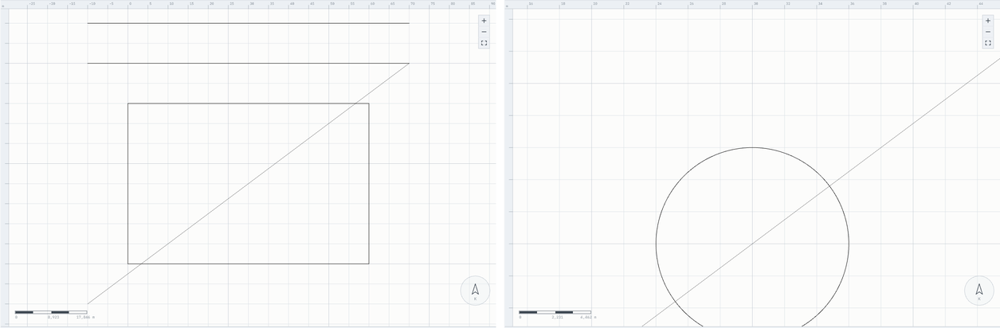
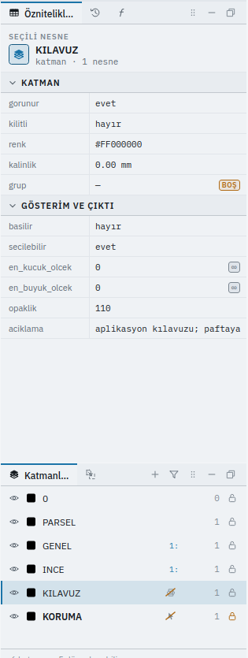
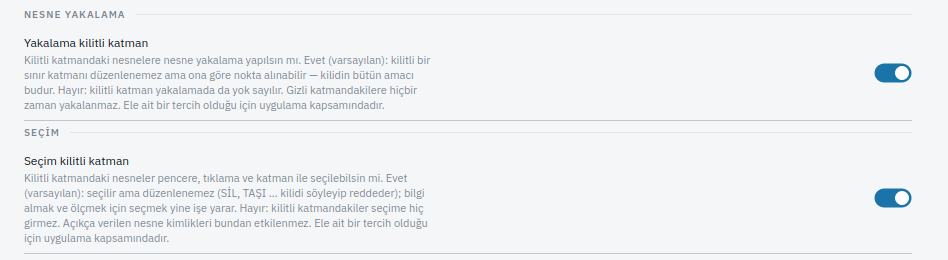

# KATMAN — Katman Yönetimi

Çizimini katmanlara ayıran herkes için; bu sayfayı bitirdiğinizde katman yaratmayı, aktif
katmanı değiştirmeyi, görünürlük, kilit ve renk ayarlamayı bileceksiniz.

## Ne yapar

Adı verilen katmanı **yoksa yaratır** ve her hâlükârda **aktif katman yapar**. Bundan
sonra çizdiğiniz her şey bu katmana gider.

İsteğe bağlı parametrelerle katmanın görünürlüğünü, kilidini ve rengini de aynı komutta
değiştirebilirsiniz.

Her çizim `0` adlı katmanla açılır.

## Adlar

| Ad | Tür |
|---|---|
| `KATMAN` | Türkçe, birincil |
| `LAYER` | İngilizce karşılık |
| `KAT` | Kısaltma |
| `core.layer` | Komut kimliği |
| `TABAKA` | **Netcad'deki adı, komut adı değil.** Komut Ara (`Ctrl+K`) ve `YARDIM komut=TABAKA` bulur; komut satırında bu komutu başlatmaz, çünkü bir katmana `TABAKA` adı da verilir |

## Sözdizimi

```
KATMAN
KATMAN <ad>
KATMAN ad=<ad> [gorunur=<evet|hayır>] [kilitli=<evet|hayır>] [renk=<tamsayı>]
KATMAN ad=<ad> [basilir=<evet|hayır>] [secilebilir=<evet|hayır>] [en_kucuk_olcek=<N>]
               [en_buyuk_olcek=<N>] [opaklik=<0-255>] [aciklama="<metin>"]
```

Argümansız çağırırsanız komut katman adını sorar.

## Parametreler

| Parametre | Ne yapar |
|---|---|
| `ad` | Katman adı. Zorunlu. Yoksa katman yaratılır, her hâlükârda aktif olur |
| `gorunur` | Katmanın görünürlüğü. `evet` / `hayır` |
| `kilitli` | Katman kilidi. Kilitli katmana çizilemez, üzerindeki nesne düzenlenemez; seçilebilir ve nokta almak için yakalanabilir ([kilit ve imleç](#kilitli-ve-gizli-katman-imlecin-altında)) |
| `renk` | Çizim rengi, `0xAARRGGBB` biçiminde tam sayı. Yeni katman **siyah** başlar |
| `basilir` | Paftaya basılsın mı. `hayır`: ekranda çizilir, çıktıda yoktur (kılavuz, yardımcı katman) |
| `secilebilir` | Seçim bu katmanın nesnelerini alsın mı. `hayır`: çizilir ve **yakalanır** ama pencere, tıklama ve `SEÇ mod=KATMAN` onu seçmez; `nesneler=` ile adıyla verilirse seçilir |
| `en_kucuk_olcek` | Görünür kaldığı en küçük ölçeğin `1:N` paydası (en uzak görünüm): bundan uzaktan bakınca katman gizlenir. `0` sınırsız |
| `en_buyuk_olcek` | Görünür kaldığı en büyük ölçeğin `1:N` paydası (en yakın görünüm): bundan yakından bakınca gizlenir. `0` sınırsız |
| `opaklik` | Ekranda opaklık, `0` saydam – `255` opak. Paftada katman her zaman opak basılır |
| `aciklama` | Katmanın açıklaması, serbest metin |

Tipleri ve adetleri için üretilmiş [komut referansına](referans.md) bakın.

Evet/hayır değerleri için `evet`, `hayır`, `yes`, `no`, `true`, `false`, `1`, `0` kabul
edilir.

### Dört ayrı soru: görünür mü, basılır mı, seçilir mi, düzenlenir mi

Bir katman bunların her birine ayrı cevap verir ve biri ötekini kendiliğinden değiştirmez:

| Soru | Parametre | `hayır` olunca |
|---|---|---|
| Ekranda **görünür** mü | `gorunur` | Çizilmez, yakalanmaz, seçilmez |
| Paftaya **basılır** mı | `basilir` | Ekranda durur, çıktıdan düşer |
| **Seçilir** mi | `secilebilir` | Çizilir, yakalanır, düzenlenebilir; seçim üzerinden geçer |
| **Düzenlenir** mi | `kilitli=evet` | Çizilir, yakalanır, seçilir; düzenleme reddedilir |

Hepsi **tek geri alma adımıdır** ve dosyaya yazılıp geri okunur. `basilir`, `secilebilir`,
ölçek aralığı, `opaklik` ve `aciklama` bir komutla tek satırda verilebilir; yalnız adı geçenler
değişir. Boş bir ölçek aralığı (en küçük ölçek paydası en büyüğününkinden küçük) katmanı hiçbir
yakınlaştırmada göstermeyeceği için reddedilir.

### Ölçek aralığı, basılabilirlik ve opaklık ekranda ve çıktıda

- **Ölçek aralığı** katmanı görünüm aralığın dışına çıkınca gizler — iki yandan: `en_kucuk_olcek`
  (örneğin `25000`) bundan **uzaktan** bakınca, `en_buyuk_olcek` (örneğin `500`) bundan **yakından**
  bakınca katmanı saklar; sınırlar dahildir (`1:25000` tam o ölçekte hâlâ çizer). Aynı kural
  hem tuvalde hem çıktı yerleşiminin harita çerçevesinde geçerlidir.
- **`basilir=hayır`** katman ekranda durur, **paftada ve çıktıda yoktur** (aplikasyon kılavuzu,
  çalışma çizgisi).
- **`opaklik`** yalnız ekranı etkiler; pafta her zaman opak basılır.



Katman listesinde varsayılandan farklı her özellik satırda küçük bir işaretle görünür (basılmaz,
seçilmez, ölçek aralığı `1:`); fareyle üzerine gelince hepsi yazıyla açıklanır. **Öznitelikler**
panelinde bir katman seçiliyken **GÖSTERİM VE ÇIKTI** grubunun her satırı onu yazan komuttur
(düzenleyince tek geri alma adımı), boş bir ölçek aralığı burada da gerekçesiyle reddedilir:



### Kilitli ve gizli katman imlecin altında

Kilit nesneyi **düzenlemeden** korur; ona bakmayı, ölçmeyi ve ona göre nokta almayı engellemez
(bir sınır katmanını kilitlemenin amacı tam budur). Bu yüzden varsayılanda kilitli katmandaki
nesneler seçilir ve nesne yakalama onları bulur; `SİL`, `TAŞI` gibi düzenlemeler kilidi
söyleyip reddeder. İsterseniz bunu ayrı ayrı kapatırsınız
(**Ayarlar ▸ Çizim ve Yakalama**, ya da `TERCİH`):

| Ayar | Varsayılan | Kapatınca |
|---|---|---|
| `core.yakalama.kilitli_katman` | evet | Nesne yakalama kilitli katmandaki nesneleri yok sayar |
| `core.secim.kilitli_katman` | evet | Pencere, tıklama ve `SEÇ mod=KATMAN` kilitli katmandakileri seçmez. `nesneler=` ile açıkça verilen kimlikler etkilenmez |



**Gizli** katmandaki nesneler ise ayardan bağımsız olarak ne seçilir ne yakalanır: görünmeyen
bir şeye nokta almak, ekrandaki görüntüden başka bir çizime göre çalışmak olurdu.

### Renk değerleri

`renk` bir tam sayıdır ve `0xAARRGGBB` düzenindedir: alfa, kırmızı, yeşil, mavi.

| Renk | Onaltılık | Ondalık |
|---|---|---|
| Yeşil | `0xFF2E7D32` | `4281236786` |
| Gri | `0xFF5D6470` | `4284310640` |
| Turuncu | `0xFFE06C00` | `4292897792` |
| İndigo | `0xFF3949AB` | `4281944491` |

Komut satırından ondalık değeri yazın:

```
KATMAN ad=PARSEL renk=4281236786
```

Katmanın o anki rengini `#AARRGGBB` biçiminde **Öznitelikler** panelinden okuyabilirsiniz.

## Örnekler

### Komut satırı

Katman yarat ve aktif yap:

```
KATMAN ad=PARSEL
```

Yaratırken rengini de ver:

```
KATMAN ad=PARSEL renk=4281236786
```

Var olan bir katmanı gizle:

```
KATMAN ad=YOL gorunur=hayır
```

Kilitle, böylece yanlışlıkla üzerine çizilmesin — ve işiniz bitince aç:

```
KATMAN ad=SINIR kilitli=evet
KATMAN ad=SINIR kilitli=hayır
```

Kilitli bir katmana yeni nesne çizilemez. Kilidi açmayı unutursanız çizim komutu
sizi reddeder ve sebebini söyler.

Adında boşluk olan katman:

```
KATMAN ad="YOL KENARI"
```

Aktif katmanı geri değiştir:

```
KATMAN ad=0
```

### Katman ağacı

Katmanlar bir ağaçta gruplanabilir ve grup çizimin parçasıdır: dosyaya yazılır,
başka makinede geri gelir, paftayı beş yıl sonra açan kişinin ilk okuduğu şeydir.

```
KATMAN ad=PARSEL grup=KADASTRO
KATMAN ad=BINA grup=KADASTRO
KATMAN ad=YOL grup="ULASIM > KARAYOLU"
KATMAN ad=DEMIRYOLU grup="ULASIM > RAYLI"
```

Katmanlar paneli bu ağacı gösterir. Ayraç `>`, sembol rafındakiyle aynı sebeple:
MPYY kendi bölüm yollarını böyle yazıyor ve pakette hiçbir ad bu karakteri
içermiyor.

Bir katmanı kökten çıkarmak için grubu boş verin:

```
KATMAN ad=NOT grup=""
```

### Arayüz

Şeridin **Giriş ▸ Katmanlar** panelindeki **katman listesi** doğrudan çalışır: renk
kutucuklarıyla katmanları gösterir, seçim yokken seçtiğiniz katmanı `KATMAN ad="..."` ile
aktif yapar. (Seçim varken aynı liste seçili nesneleri o katmana taşır; bkz.
[`KATMANAT`](set_layer.md).) Listenin altındaki **Etkin Yap** simgesi seçili nesnenin
katmanını aktif yapar.

Yeni bir katmanı **Katmanlar** panelinin başlığındaki **+** açar; büyük **Katmanlar**
düğmesi (**Giriş ▸ Katmanlar**, **Görünüm ▸ Katmanlar**) paneli gösterir.

Sağdaki **Katmanlar** paneli her katmanı tek bir satırda gösterir: solda **göz**,
yanında renk kutucuğu, katmanın adı, sağda nesne sayısı ve **kilit**.

| Nerede | Ne yapar |
|---|---|
| **Göz** simgesine tek tık | Görünürlüğü ters çevirir — bu, `KATMAN` değil [`KATMANGÖRÜNÜM`](layer_visibility.md) satırıdır ve aktif katmanı değiştirmez |
| **Kilit** simgesine tek tık | Kilidi ters çevirir |
| Satıra çift tık | O katmanı **aktif** yapar |
| Ctrl / Shift ile tık | **Birden fazla katman** seçer |
| Satıra sağ tık | Katman menüsü: **Tümünü seç**, **Katmana yakınlaş**, **Öznitelik tablosu**, aktif yap, [**Görünüm**](layer_visibility.md) alt menüsü, gruba taşı… ve en altta **Katman Özellikleri…** |

**Tümünü seç**, o katmandaki bütün nesneleri seçer — çalıştırdığı satır
[`SEÇ mod=KATMAN katman="..."`](select.md) satırıdır.

**Katmana yakınlaş**, o katmanın bütün nesnelerini — gizli olanlar da dahil — görünüme
sığdırır; çalıştırdığı satır [`YAKINLAŞ KATMAN katman="..."`](zoom.md) satırıdır.

**Öznitelik tablosu**, [o katmanın öznitelik tablosunu](../veri/oznitelik-tablosu.md)
açar. **Sağ tıkladığınız katmanın**, aktif katmanın değil: bir katmanın
özniteliklerine bakmak için önce onu aktif yapmanız gerekmez. Pencere başlığı
hangi katmanda olduğunuzu yazar ve alt satır kaç nesne gösterdiğini söyler —
şeritteki **Analiz ▸ Tablo ▸ Öznitelik Tablosu** (**F6**) ise aktif katmanı açar, çünkü
orada işaret edilmiş bir katman yoktur.

Çizimde bir nesne seçtiğinizde **panel o nesnenin katmanını kendiliğinden
işaretler**, böylece kırk katmanlı bir listede aramak zorunda kalmazsınız.
Seçimde birden çok katmandan nesne varsa tek doğru cevap olmadığı için işaret
yerinde bırakılır. Bu işaretleme yalnızca listedeki vurgudur: katmanı **aktif
yapmaz**, çünkü aktif katmanı değiştirmek kimsenin istemediği bir düzenlemedir.

**Görünüm** alt menüsü göster, gizle, yalnız bunu göster, tümünü göster ve gösterimi
ters çevir girişlerini taşır; seçili katmanların tamamına uygulanır ve tek bir Ctrl+Z ile
geri gelir. Ayrıntısı [`KATMANGÖRÜNÜM`](layer_visibility.md) sayfasındadır. Kilit tek
satıra uygulanır.

Panelden yapılan her değişiklik arka planda bir komut gönderir — görünürlük
[`KATMANGÖRÜNÜM`](layer_visibility.md), geri kalanı `KATMAN`. Yani buradan yaptığınız
değişiklik de günlüğe yazılır ve **Ctrl+Z** ile geri alınır.

Aktif katman panelde **kalın** yazılır ve durum çubuğunun **Katman:** bölmesinde görünür.

### Betik

```json
{
  "ad": "Katman kurulumu",
  "komutlar": [
    { "cmd": "core.layer", "args": { "ad": "PARSEL", "renk": 4281236786 } },
    { "cmd": "core.layer", "args": { "ad": "YOL",    "renk": 4284310640 } },
    { "cmd": "core.layer", "args": { "ad": "BINA",   "renk": 4292897792 } },
    { "cmd": "core.layer", "args": { "ad": "SINIR",  "renk": 4281944491, "kilitli": true } },
    { "cmd": "core.layer", "args": { "ad": "PARSEL" } }
  ]
}
```

Son satır aktif katmanı `PARSEL`'e geri alır, çünkü betikte son çalışan `KATMAN` komutu
aktif katmanı belirler.

## Geri alma

Görünürlük, kilit ve renk değişiklikleri geri alınabilir. `GERİAL` **son** komutu
geri alır, o yüzden örnek neyi geri aldığını kendisi yazar — ve daha önce hangi
durumda olduğunuza bağlı kalmasın diye kendi katmanını kullanır:

```
KATMAN ad=ÖLÇÜ kilitli=evet
GERİAL
KATMAN ad=0
```

`GERİAL`'den sonra `ÖLÇÜ` yeniden düzenlenebilir. Son satır aktif katmanı geri
alır; **aktif katman değişikliği geri alınmaz**, çünkü aktif katman görünüm
durumudur, çizimin verisi değildir.

**Boş bir katman yaratmak geri alınmaz.** Bunun sebebi şudur: boş katman hiçbir şeyi
etkilemez, ama katmanı silmek ona bağlı nesne kimliklerini geçersiz kılardı. Yarattığınız
ama istemediğiniz bir katman çiziminizde zararsız biçimde durur.

Aktif katman değişikliği de geri alınmaz; aktif katman görünüm durumudur, çizimin verisi
değildir.

## Betikten kullanım

`KATMAN` betiklenebilir ve AI erişimlidir. Tipik kullanım, bir betiğin başında bütün
katmanları renkleriyle kurmak, sonra her çizim grubundan önce aktif katmanı değiştirmek:

```json
[
  { "cmd": "core.layer", "args": { "ad": "PARSEL", "renk": 4281236786 } },
  { "cmd": "core.line",  "args": { "noktalar": [[485300000,4310200000],[485360000,4310200000]] } },
  { "cmd": "core.layer", "args": { "ad": "BINA", "renk": 4292897792 } },
  { "cmd": "core.line",  "args": { "noktalar": [[485315000,4310212000],[485345000,4310212000]] } }
]
```

Ayrıntı: [Betik yazma](../betik/README.md).

## Hatalar

| Mesaj | Sebep | Çözüm |
|---|---|---|
| `'core.layer': zorunlu 'ad' parametresi eksik. Beklenen: metin` | Katman adı verilmemiş | `ad=` ile ad verin |
| `'core.layer': bilinmeyen parametre 'renkler'. Tanımlı parametreler: ad, gorunur, kilitli, renk` | Parametre adı yanlış yazılmış | Doğru adı kullanın |
| `'core.layer': 'gorunur' parametresi evet/hayır bekliyor. Girilen: 'belki'` | Geçersiz evet/hayır değeri | `evet` veya `hayır` yazın |
| `Bilinmeyen katman kimliği: 7` | Var olmayan katmana işlem yapılmaya çalışılmış | Katman adını denetleyin |

Ad vermeden **Esc**'e basarsanız hata olmaz; komut hiç çalışmamış sayılır ve transkriptte
`İptal edildi` yazar.

Bütün hata mesajları: [Sorun giderme](../sorun-giderme.md).
