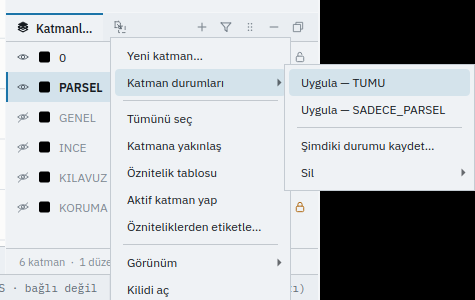

# KATMANDURUM — Kayıtlı Katman Durumları

Bir çizimi başka başka biçimlerde çalıştıran herkes için — yalnız ölçü noktaları; inceleme için
imar planı; aynısının baskıdaki hâli. Bu sayfayı bitirdiğinizde hangi katmanların görünür,
kilitli, basılır ve seçilir olduğunu bir ad altında kaydetmeyi, tek adımda geri getirmeyi ve
silmeyi bileceksiniz.

## Ne yapar

Kırk katmanı tek tek açıp kapatmak yerine **bir durum kaydedersiniz**: o anda her katmanın
dört cevabı — **görünür mü** (`gorunur`), **kilitli mi** (`kilitli`), **basılır mı** (`basilir`),
**seçilir mi** (`secilebilir`) — çizimin içine bir adla yazılır. Sonra o adı **uygularsınız**
ve bütün katmanlar kayıttaki gibi olur. Durum çizimin içindedir: dosyayla gelir, bir meslektaşınız
dosyayı açtığında kendi durumlarını bulur, geri alınır, çizimin parmak izine girer.

Durum **katmanın kalıcı anahtarıyla** tutulur. Kayıttan sonra silinmiş bir katman uygulamada
söylenerek **atlanır**, başka bir katmana eşlenmez. Kayıttan sonra açılan bir katman durumda yoktur;
uygulama ona dokunmaz. Etkin katmana, renge, ölçek aralığına ve opaklığa da dokunmaz.

## Adlar

`KATMANDURUM`, `KATMANDURUMU`, `LAYERSTATE`, `KDR`.

## Sözdizimi

```text
KATMANDURUM
KATMANDURUM islem=kaydet ad=<ad>
KATMANDURUM islem=uygula ad=<ad>
KATMANDURUM islem=sil ad=<ad>
```

## Parametreler

| Parametre | Ne yapar |
|---|---|
| `islem` | `liste` (varsayılan), `kaydet`, `uygula` ya da `sil` |
| `ad` | Durumun adı; `kaydet`, `uygula` ve `sil` için gerekir. Büyük/küçük harf ve Türkçe harf farkı gözetilmez (`PLAN`, `plan`, `Plan` aynı durumdur) |

`kaydet`, aynı adlı bir durum varsa onu yenisiyle **yerinde değiştirir**.

## Örnekler

### Komut satırı

```text
KATMANDURUM islem=kaydet ad=HEPSI
KATMAN ad=YOL kilitli=evet basilir=hayır
KATMAN ad=BINA gorunur=hayır
KATMANDURUM islem=kaydet ad=INCELEME
KATMANDURUM islem=uygula ad=HEPSI
KATMANDURUM
```

### Arayüz

**Katmanlar** panelinde herhangi bir satıra sağ tıklayın ▸ **Katman durumları**: kayıtlı her durum
bir **Uygula — ad** satırıdır, **Şimdiki durumu kaydet…** ad sorar, **Sil** durumu unutturur.
Menü satırları bu komutun kendisini gönderir; panel ikinci bir yol değildir.



### Betik

```json
{ "ad": "Durum", "komutlar": [
  { "cmd": "core.layer_state", "args": { "islem": "kaydet", "ad": "HEPSI" } },
  { "cmd": "core.layer", "args": { "ad": "BINA", "gorunur": false } },
  { "cmd": "core.layer_state", "args": { "islem": "uygula", "ad": "HEPSI" } }
] }
```

## Geri alma

Kaydetmek, silmek ve uygulamak **birer geri alma adımıdır**. Bir durumu uygulamak, kırk katmanı
birden değiştirse de tek `GERİAL` ile geri döner.

## Betikten kullanım

Komut insan olmayan istemciye de çalışır; çizimi bozmaz: bir ajan durumu önce **önizler**, sonra
onayla uygulatır ([Onay ve denetim](../yapay-zeka/onay.md)).

## Hatalar

| Mesaj | Neden | Çözüm |
|---|---|---|
| `Katman durumu yok: 'X'. Kayıtlılar: …` | Böyle bir ad kayıtlı değil | `KATMANDURUM` ile listeye bakın |
| `'kaydet' için durumun adı gerekir: ad=<ad>` | `ad` verilmedi | Ad ekleyin |
| `Tanınmayan işlem: 'X'. İşlemler: liste / kaydet / uygula / sil` | Yanlış `islem` | Dört sözcükten birini yazın |

Uygularken `N katman artık çizimde yok, atlandı` yazarsa durum kaydedildikten sonra o katmanlar
silinmiştir; geri kalanı uygulanmıştır.

## Bakınız

- [`KATMAN`](layer.md) — katmanın dört cevabı ve ölçek aralığı
- [`KATMANGÖRÜNÜM`](layer_visibility.md) — görünürlüğü toptan değiştirir
- [`KATMANLAR`](layers.md) — katman dökümü
