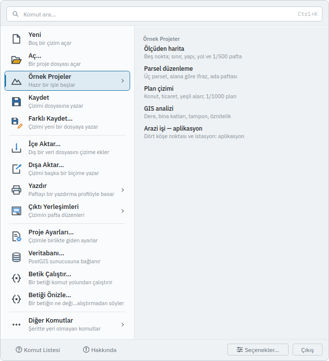

# ÖRNEKPROJE — Hazır Bir Örnekle Başlayın

PiriCAD'i ilk kez açan, boş tuvale bakıp nereden başlayacağını bilmeyen herkes için. Bu
sayfayı bitirdiğinizde bir örnek projeyi açmayı, onu düzenlemeyi ve ölçeği doğru bir pafta
çıkarmayı bileceksiniz. Aynı akışın adım adım anlatımı: [Örnek projelerle başlayın](../baslangic/ornek-projeler.md).

## Ne yapar

`ÖRNEKPROJE`, ekrandaki çizimin yerine **hazır, küçük ve bitmiş bir iş** koyar. Beş tane vardır:

| Kimlik | İş | Ne öğretir |
|---|---|---|
| `olcuden-harita` | **Ölçüden harita** | Ölçülmüş beş noktadan sınır, yapı ve yol; 1/500 pafta |
| `parsel-duzenleme` | **Parsel düzenleme** | Yan yana üç parsel, öznitelikten etiket, alana göre ifraz; ada paftası |
| `plan-cizimi` | **Plan çizimi** | Konut, ticaret ve yeşil alan kullanımları; 1/1000 plan paftası |
| `gis-analiz` | **GIS analizi** | Dere ve binalar; tampon ve öznitelik tablosu |
| `aplikasyon` | **Arazi işi — aplikasyon** | Köşe noktaları ve istasyon; yön ve mesafe raporu |

Her proje **komutlarla kurulur**: bir betiktir (`data/ornekler`), sizin çiziminizi kuran komutların
aynısını çalıştırır, bu yüzden bir sonraki adımda yapacağınız her şeyi onun üzerinde de yapabilirsiniz.
Koordinatlar kurgusaldır; gerçek bir parsele, adaya ya da kişiye ait değildir.

Komut şunları sırasıyla yapar:

1. Çizimi boş bir çizimle değiştirir (`YENİ`). Örnek, çalıştığınız çizime **dökülmez**.
2. Projenin betiğini tek bir geri alma adımı olarak çalıştırır.
3. Görünümü çizime oturtur.
4. Projenin ne olduğunu, varsa hazır paftasını ve **sıradaki denemeleri** söyler. Denemeler, komut
   satırına olduğu gibi yazabileceğiniz satırlardır.

> **Kaydedilmemiş çalışmanın üstüne yazar.** `YENİ` ve `AÇ` gibi, komutun kendisi sormaz; pencerede
> **Dosya ▸ Örnek Projeler** ile açarsanız program önce "kaydedilsin mi?" diye sorar. Komut satırından,
> betikten ya da başka bir istemciden yazdıysanız soru yoktur.

## Adlar

| Ad | Tür |
|---|---|
| `ÖRNEKPROJE` | Türkçe, birincil |
| `ORNEKPROJE` | ASCII karşılığı |
| `ÖRNEK`, `ORNEK` | Kısaltma |
| `SAMPLE` | İngilizce karşılığı |
| `core.sample` | Komut kimliği |

## Sözdizimi

```text
ÖRNEKPROJE
ÖRNEKPROJE ad=<kimlik ya da başlık>
```

## Parametreler

| Parametre | Ne yapar |
|---|---|
| `ad` | Açılacak projenin **kimliği** (`olcuden-harita`) ya da **başlığı** (`Ölçüden harita`). Türkçe harf farkı gözetilmez. Verilmezse beş proje listelenir ve hangisi sorulur |

## Örnekler

### Komut satırı

```
ÖRNEKPROJE ad=olcuden-harita
```

Komut, çizimi kurar ve transkriptte (**Geçmiş** sekmesi) şunu yazar:

```text
Örnek proje açıldı: Ölçüden harita. Arazide ölçülmüş beş detay noktasından sınırı, yapıyı ve
yolu çıkarıp 1/500 ölçekli bir pafta basar.
Pafta hazır: 'Harita 1-500' yerleşimi 1:500 ölçeğinde.
Deneyin — her satırı komut satırına olduğu gibi yazabilirsiniz:
  1. ALANÖLÇ nesneler=6
     Parselin alanını ve çevresini okuyun.
  2. ÇIKTIYERLEŞİMİ islem=denetle ad="Harita 1-500"
     Basmadan önce yerleşimin eksiğini sorun.
  3. YAZDIR yerlesim="Harita 1-500" dosya=olcuden-harita.pdf
     1/500 ölçekli PDF'i yazın.
```

Kimlik yerine başlık da olur:

```
ÖRNEKPROJE ad="Parsel düzenleme"
```

`ad` verilmezse program listeyi yazar ve hangisini istediğinizi sorar:

```
ÖRNEKPROJE
```

### Arayüz

Uygulama menüsünü açın (sol üstteki **PiriCAD** düğmesi) ▸ **Örnek Projeler** ▸ bir proje. Menü
satırı `ÖRNEKPROJE ad=…` komutunu gönderir; ikinci bir yol değildir. Sağdaki panel **Geçmiş**
sekmesine geçer, çünkü projenin açıklaması ve denemeler orada yazılır.



Komut paleti (**Ctrl+K**) ve komut satırı da aynı komutu açar: `örnek` yazıp Enter.

### Betik

```json
{
  "ad": "Örnek proje",
  "komutlar": [
    { "cmd": "core.sample", "args": { "ad": "parsel-duzenleme" } }
  ]
}
```

Bir betiğin içindeki `ÖRNEKPROJE`, projenin komutlarını **betiğin kendi geri alma adımına katar**:
betik tek adımdır, bir komutu başarısız olursa hepsi geri alınır.

## Geri alma

Proje **tek geri alma adımıdır**: `GERİAL` projenin **nesnelerini ve paftasını** geri alır.
**Katmanlar ve öznitelik sütunu tanımları kalır** (boş), çünkü katman ve sütun tanımı kendi başına
geri alınmaz ([`KATMAN`](layer.md), [`SÜTUN`](column.md)); onlardan da kurtulmak için `YENİ` yazın.
Komutun kendisi çalışmakta olan çizimi değiştirdiği için, ondan **önceki çizime** `GERİAL` ile
dönülmez — `YENİ` ve `AÇ` de dönmez.

## Betikten kullanım

Komut kaydedilmemiş çalışmanın üstüne yazar ve geri alınamaz; bu yüzden **yapay zekâya kapalıdır**.
Bir ajan, yeni bir çizim isteyen kullanıcıya bunu söyleyip komutu önerebilir ama kendisi çalıştıramaz.

Günlükte `ÖRNEKPROJE` satırı yazılmaz; `YENİ` ve projenin komutları yazılır. Günlük yeniden
oynatıldığında aynı çizim çıkar ve komut iki kere çalışmış olmaz.

## Hatalar

| Mesaj | Neden | Çözüm |
|---|---|---|
| `'X' adında bir örnek proje yok. Olanlar: olcuden-harita, …` | `ad` bilinen bir kimlik ya da başlık değil | Mesajdaki beş kimlikten birini yazın ya da `ÖRNEKPROJE` yazıp listeden seçin |
| `Örnek projeler bulunamadı: 'data/ornekler/ornekler.json' yok. …` | Kurulumda veri paketi eksik ya da bulunamıyor | `PIRICAD_DATA` ortam değişkenini veri dizinine gösterin ([Kurulum](../baslangic/kurulum.md)) |
| `'X' örnek projesi kurulamadı: …` | Projenin betiğindeki bir komut çalışmadı; ardından bütün proje geri alındı | Mesajın devamı hangi komutun neden başarısız olduğunu söyler; çizim boş kalır |
| `Betik motoru bağlı değil; bu ortamda örnek proje açılamaz.` | Betik motorsuz bir ortam (testler) | Normal kurulumda görülmez |

## Bakınız

- [Örnek projelerle başlayın](../baslangic/ornek-projeler.md) — beş projenin adım adım anlatımı
- [`YENİ`](new.md) — boş çizim
- [`AÇ`](open.md) — bir proje dosyası açar
- [`BETİK`](script.md) — kendi betiğinizi çalıştırır; örnek projeler de birer betiktir
- [`ÇIKTIYERLEŞİMİ`](layout.md) ve [`YAZDIR`](print.md) — paftayı kâğıda ya da PDF'e dökmek
