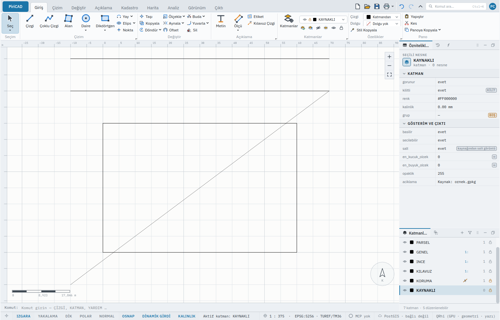

# KAYNAK — Veri Kaynağı Bilgisi

Başka bir kurumdan ya da programdan veri alan, ama dosyaya ne koyduğunu bilmeden içeri almak
istemeyen herkes için. Bu sayfayı bitirdiğinizde bir dosyanın **ne olduğunu ve neler yapabildiğini**
içe almadan okumayı, PiriCAD'in onunla ne yapıp ne yapmadığını ayırt etmeyi ve bir kaynağı **salt
görüntü** mü yoksa **düzenlenebilir kopya** mı olarak alacağınıza karar vermeyi bileceksiniz.

## Ne yapar

`KAYNAK`, bir veri dosyasını **salt okunur** açar ve yalnız üst bilgisini okur; çizime hiçbir şey
eklemez, geri alınacak bir şey bırakmaz. Her katman için şunları söyler:

| Soru | Cevabın kaynağı |
|---|---|
| **Kaynak ve sürücü**: dosya hangi biçimde, hangi GDAL sürücüsüyle açıldı | GDAL |
| **Kimlik**: katmanın adı, satır kimliği sütunu, geometri sütunu | GDAL |
| **Koordinat sistemi** ve neyi saydığı (metre, derece, ayak) | GDAL / PROJ |
| **Satır tahmini**: kesin mi (kaynak sayıyı ucuza veriyor) yoksa tahmin mi | GDAL |
| **Alanlar ve kısıtları**: tür, genişlik, *boş olamaz*, *benzersiz*, varsayılan, alan kuralı | GDAL |
| **Yetenekler**: rastgele okuma, dizinli konum süzgeci, hızlı sayım, işlem (*transaction*), eğri, Z, M | GDAL |
| **PiriCAD ne yapar**: okur mu, yazar mı, içe alırken neyi atar ya da taşımaz | PiriCAD'in izin listesi ve davranışı |

Son satır bilerek ayrıdır: **GDAL'da bir biçimin var olması, bütün yeteneklerinin PiriCAD'de
desteklendiği anlamına gelmez.** Bir sürücü yeni veri kümesi yazabilir ve PiriCAD o biçimi yine de
yazmaz; bir katman gerçek eğri taşıyabilir ve PiriCAD içe alırken onu çizgi parçalarına çevirir. Rapor
iki cevabı yan yana koyar.

> **PiriCAD kaynağa geri yazmaz.** İçe aldığınız, kaynağın bir kopyasıdır; değişikliği
> [`DIŞAAKTAR`](export.md) yeni bir dosyaya yazar. Bu cümle her raporun başında durur, çünkü
> "dosyayı açıp düzenledim" izlenimi en kolay yanlış anlaşılan şeydir.

## Adlar

| Ad | Tür |
|---|---|
| `KAYNAK` | Türkçe, birincil |
| `KAYNAKBİLGİ`, `KAYNAKBILGI` | Türkçe eş ad |
| `SOURCE` | İngilizce karşılık |
| `KYN` | Kısaltma |
| `core.source` | Komut kimliği |

## Sözdizimi

```text
KAYNAK <dosya>
KAYNAK dosya=<dosya> [katman=<ad>]
```

## Parametreler

| Parametre | Ne yapar |
|---|---|
| `dosya` | İncelenecek kaynağın yolu. İçinde boşluk varsa tırnak içine alın |
| `katman` | Yalnız bu katmanı anlatır (Türkçe harf farkı gözetilmez); verilmezse bütün katmanlar |

## Örnekler

### Komut satırı

Bir GeoPackage (örnek yol; kendi dosyanızı yazın):

```text
KAYNAK parsel.gpkg
```

```text
Kaynak: parsel.gpkg
Sürücü: GPKG (GeoPackage)
  PiriCAD okur (İÇEAKTAR): var · yazar (DIŞAAKTAR): var · sürücü yeni veri kümesi yazabilir: var · katman ekleyebilir: var · katman silebilir: var
  PiriCAD kaynağa GERİ YAZMAZ: içe alınan bir kopyadır; değişikliği DIŞAAKTAR yeni bir dosyaya yazar.

[1] PARSEL — alan
  Sistem: EPSG:5254 (metre sayar)
  Satır: 12034 (kesin) · sınır kutusu 485300 4310200 … 485360 4310245
  Kimlik: fid (satır kimliği) · geometri sütunu: geom
  Alanlar (3): ada_no Integer64 [boş olamaz]; parsel_no Integer64 [boş olamaz, benzersiz]; ad String
  Yetenekler: rastgele okuma var · dizinli konum süzgeci var · hızlı sayım var · işlem (transaction) var · eğri var · Z var · M var
  PiriCAD içe alırken:
    - Alan kısıtları (boş olamaz, benzersiz, varsayılan, alan kuralı) içe alırken taşınmaz; sütunlar serbest açılır.
```

Aynı bilgiyi bir Shapefile için okuyunca **farkı** görürsünüz:

```text
Sürücü: ESRI Shapefile (ESRI Shapefile)
  PiriCAD okur (İÇEAKTAR): var · yazar (DIŞAAKTAR): yok · …
  Yetenekler: rastgele okuma var · dizinli konum süzgeci yok · hızlı sayım var · işlem (transaction) yok · eğri yok · Z var · M var
```

Tek bir katman için:

```text
KAYNAK dosya=parsel.gpkg katman=PARSEL
```

### Arayüz

Ayrı bir düğmesi yoktur; bilgi **İçe Aktar penceresinde** zaten görünür: dosyayı seçince katman
listesindeki her satırın üzerine geldiğinizde (ipucu) bu raporun o katmana ait kısmı çıkar — aynı
işlevden, aynı sözlerle. Komut satırı ve komut paleti (**Ctrl+K**) de `KAYNAK`'ı açar.

### Betik

```json
{
  "komutlar": [
    { "cmd": "core.source", "args": { "dosya": "parsel.gpkg", "katman": "PARSEL" } }
  ]
}
```

Yapılandırılmış sonuç (`surucu`, `katmanlar[].sistem`, `katmanlar[].satir`, `katmanlar[].yetenekler`,
`kaynaga_geri_yazma`: her zaman `false`) betiğe ve istemciye de döner.

## Geri alma

Geri alınacak bir şey yoktur: `KAYNAK` hiçbir şeyi değiştirmez, günlüğe satır yazmaz ve geri alma
yığınına dokunmaz.

## Betikten kullanım

Salt okunur olduğu için bir betiğin herhangi bir yerinde, herhangi bir sayıda çağrılabilir. Komut
satırından ve betikten aynı metni ve aynı yapılandırılmış sonucu verir.

## Hatalar

| Mesaj | Neden | Çözüm |
|---|---|---|
| `'X' açılamadı: … PiriCAD'in okuduğu biçimler: DXF, GPKG, …` | Dosya yok, bozuk ya da biçimi PiriCAD'in izin listesinde değil | Yolu denetleyin; mesajdaki biçimlerden birine çevirin |
| `Dış biçim desteği KAPALI. …` | Program GDAL olmadan derlenmiş | Mesajdaki kurulum komutunu izleyin |
| `'X' adında bir katman yok. Katmanlar: …` | `katman=` dosyada olmayan bir ad | Mesajdaki adlardan birini yazın |
| `Dosya motoru bağlı değil; …` | Dosya motoru olmayan bir ortam | Uygulama içinden çalıştırın |

## Salt görüntü mü, düzenlenebilir kopya mı

Raporu okuduktan sonra iki yoldan biri seçilir ([`İÇEAKTAR`](import.md)):

| Yol | Komut | Sonuç |
|---|---|---|
| **Düzenlenebilir kopya** (varsayılan) | `İÇEAKTAR dosya` | Katmanlar çizimin parçası olur, düzenlenir |
| **Salt görüntü** | `İÇEAKTAR dosya salt=evet` | Katmanlar **kilitli** gelir; açıklamalarında kaynak dosya adı ve sürücü yazar; kilidi `KATMAN kilitli=hayır` ile **açılamaz** |



Bir salt görüntüyü düzenlemek **ayrı bir eylemdir** ve açıkça yapılır: `KATMAN ad=PARSEL salt=hayır`
katmanı düzenlenebilir kopyaya çevirir ve aynı adımda kilidini açar (tek `GERİAL` ikisini birden
geri alır). Böylece "kaynağa bakmak" ile "kaynağın kopyasını düzenlemek" birbirine karışmaz.

## Bakınız

- [`İÇEAKTAR`](import.md) — kaynağı çizime alır; `salt=` ve `cevir=` seçenekleri
- [`KATMAN`](layer.md) — `salt=` katmanı görüntüden düzenlenebilir kopyaya çevirir
- [`DIŞAAKTAR`](export.md) — çizimi yeni bir dosyaya yazar
- [`DÖNÜŞTÜR`](reproject.md) ve [`KOORDİNAT`](coordinate.md) — sistem dönüşümü ve okuma
