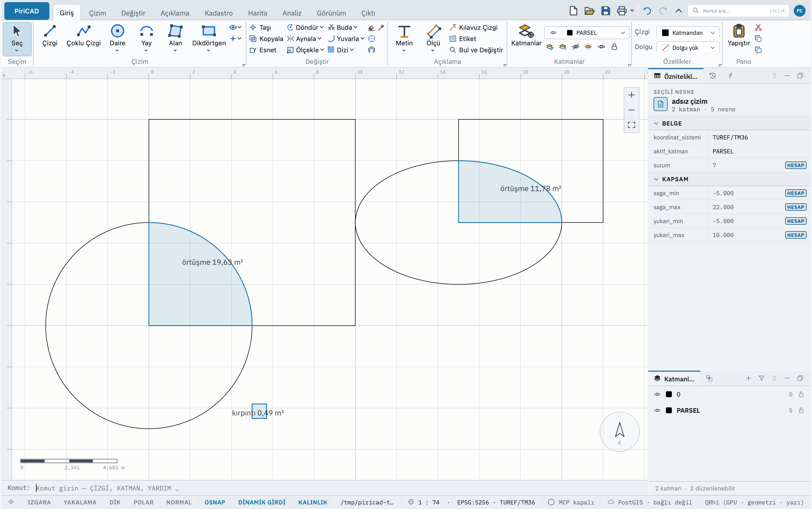
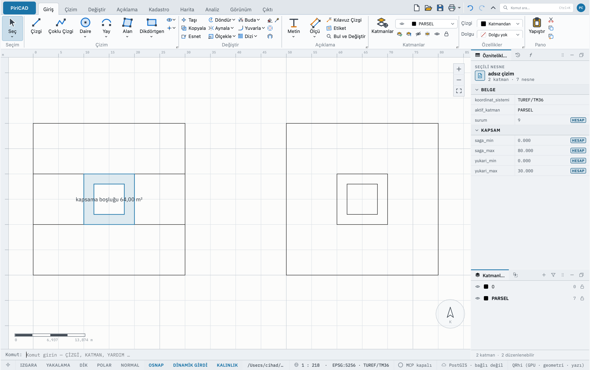

# TOPOLOJİ — Geometri Denetimi

## Ne yapar

Bir kadastro paftasının teslim edilmeden önce geçmesi gereken denetimleri yapar
ve **rapor eder**:

| Kusur | Ne demek |
|---|---|
| **Sınır kendini kesiyor** | Halka kendi üzerinden geçiyor; alanı belirsiz |
| **Alanı sıfır** | Halka hiçbir şey çevrelemiyor |
| **Örtüşüyor** | İki parsel aynı zemini talep ediyor; örtüşen alan yazılır |
| **Yinelenen** | Aynı tür, aynı katman, aynı köşelerle ikinci kez çizilmiş nesne; hangisinin aynısı olduğu yazılır |
| **Uzunluğu yok** | Bütün köşeleri düğüm toleransı içinde tek noktada duran çizgi; hiçbir şey çizmez |
| **Tekrarlanan köşe** | Bir öncekiyle düğüm toleransı içinde aynı yerde duran köşeler; kaç tane olduğu yazılır |
| **Boşluk** | Bir **çizgi ağında** bir ucun başka bir çizgiye değmeden durduğu yer; genişliği yazılır |
| **Geçersiz halka** | Sınırın kapanışı veya deliklerin yerleşimi geçersiz |
| **Kırpıntı adayı** | Delikler çıkarıldıktan sonra pozitif alanı projenin en küçük alan eşiğinden küçük olan kapalı yüzey |
| **Kapalı kapsama boşluğu** | `kapsama=evet` ile aynı katmandaki alanların çevrelediği, hiçbir alanın kaplamadığı zemin |

Dört bin parselli bir paftada bunların hiçbiri bakışta görünmez — komut bunun
için vardır. Her kusur tuvalde de işaretlenir: bir örtüşme iki parselin birlikte
talep ettiği zemin olarak (alanıyla), bir boşluk açık uçtan en yakın çizgiye bir çizgi
olarak, kırpıntı adayı kendi sınırı ve alanıyla, ötekiler bir nokta olarak.

OpenCASCADE alanların gerçek sınırlarını denetler: doğru ve yay kenarlı alanlar,
daireler, elipsler ve uçları birbirine dönen kapalı spline'lar. Eğriler alan
hesabından önce düz parçalara çevrilmez. İşaretin ekranda çizilmesi için üretilen
köşeler çizime yazılmaz; alan ve tolerans hesabı gerçek eğriden yapılır.



Bu [örnek sahne](../../tests/bench/sahne/topoloji-occt.json) varsayılan toleranslarla
5 m yarıçaplı dairenin dörtte birini 19,63 m², 5 × 3 m elipsin dörtte birini
11,78 m² olarak işaretler; ayrı 0,49 m² yüzey kırpıntı adayıdır.

### Önce sayı, sonra ilk yirmi

Rapor önce **ne kadar** ve **ne tür** kusur bulunduğunu söyler, sonra ilk yirmisini tek
tek yazar; gerisi sayılır ("… ve 480 kusur daha; hepsi tuvalde işaretli."). Dört bin
örtüşmeli bir paftada dört bin satırlık bir döküm, hiç yazılmamış bir döküm kadar
okunmaz. Kusurların **tamamı** yapılandırılmış cevaptadır (bkz. [Betikten
kullanım](#betikten-kullanım)).

### Uzun bir iş: ilerleme ve Durdur

Yüz bin parsellik bir pafta saniyeler sürer ve bu sürede pencere donmaz: denetim ayrı
bir iş parçacığında koşar, durum çubuğu `Topoloji denetimi · %40` gibi ilerlemesini
gösterir ve yanında **Durdur** çipi durur. **Durdur** ya da **Esc** denetimi keser:

```text
Topoloji denetimi durduruldu; sonuç verilmedi, çizim değişmedi.
```

Yarım bir denetim daha küçük bir denetim değildir — "kusur bulunamadı" demesi yalan
olurdu — bu yüzden durdurulan denetim hiçbir kusur söylemez ve komut günlüğüne
yazılmaz. **Enter** ya da sağ tık işi durdurmaz; iş kendi bitince biter. Denetim
sürerken çizim değiştirilemez; yazılan bir komut `Bir iş sürüyor (Topoloji
denetimi)…` cevabını alır (bkz. [Uzun işler](../baslangic/arayuz.md#uzun-işler)).

Denetim, parsellerin sınır kutuları üzerine kurulan bir mekânsal dizinle (R-ağacı)
yalnız **komşu** parselleri karşılaştırır. Yalnız kenar boyunca değen kutular alan
örtüşmesi oluşturamaz ve elenir. Aynı düz kenarlı şeklin farklı konumlardaki
örnekleri, bu denetim boyunca OpenCASCADE'in aynı geçerlilik sonucunu paylaşır.
Süre, farklı sınırların karmaşıklığına ve gerçekten örtüşen komşuların sayısına
bağlıdır; yerel örnek ölçümü [performans kaydında](../../tests/bench/README.md).

### Aynı çekirdek

Yinelenen, uzunluğu olmayan ve tekrarlanan köşeli nesneler [`TEMİZLE`](cleanup.md)'nin
bulduğuyla aynı bulucudan gelir; çizgi ağındaki boşluklar [`SINIR`](boundary.md) ve
[`ALANÜRET`](alan_uret.md)'in kapatmayı reddettiği boşluklarla aynı ağdan. Denetim ile
onarım aynı nesneleri aynı gerekçeyle görür. Çizgi ağı boşluğu yalnız açık çizgilerde aranır; bir
ucun kendi çizgisi, az önce kestiği çizgi ya da kendi zincirinden uzun bir mesafe
boşluk sayılmaz. İki ucu birbirini gören bir boşluk bir kez yazılır.

Birbirine projenin düğüm toleransından (`core.topoloji.dugum_toleransi`, varsayılan
1 cm) yakın iki köşe aynı köşe sayılır.

### Hiçbir şeyi düzeltmez

Otomatik bir düzeltme **sınırı oynatırdı**, ve sınır ölçülmüş veridir. Bir kusurun
ne anlama geldiğine mühendis karar verir ve sonucu yalnız o imzalayabilir
(CLAUDE.md 6.11).

### Ortak sınır örtüşme değildir

Sınır paylaşan iki parsel o sınır boyunca değer; ortak bir köşenin milimetreye
yuvarlanması çok uzun bir sınır boyunca ince bir şerit bırakabilir. Sabit bir
alan eşiği bu şeridi gerçek örtüşmeden ayıramaz. Her örtüşme parçasının **etkin
genişliği = 2 × net alan / çevre** OpenCASCADE'de hesaplanır; delikler alandan
çıkarılır, iç ve dış sınırlar çevreye katılır. Parçalardan birinin etkin genişliği
`düğüm_toleransı` değerini aşarsa örtüşme raporlanır. Bu ölçü uzun ve dar bir
şeritte şerit genişliğine yaklaşır; en geniş yerin ölçüsü değildir.

Varsayılan 10 mm toleransta 100 m uzunluğundaki 1 mm'lik şerit raporu doldurmaz;
25 mm'lik şerit bulunur ve **tam** 2,50 m² alanıyla yazılır. Tolerans alanı
küçültmez. `AYAR düğüm_toleransı 0` bütün pozitif örtüşmeleri bildirir.

### En küçük alan

`AYAR en_küçük_alan 500000` varsayılan 0,5 m² eşiğidir. Denetim, delikleri
çıkarılmış pozitif alanı bu değerden **küçük** olan yüzeyleri kırpıntı adayı
olarak gösterir. Eşiğe eşit alan işaretlenmez; `AYAR en_küçük_alan 0` bu denetimi
kapatır. Ayar, örtüşmeleri gizlemek için kullanılmaz. 0,01 m²'den küçük bulgular
mm² olarak yazılır; küçük bir alanın etiketi sıfır görünmez.

Bir küçük yüzeyin gerçekten hata olup olmadığına siz karar verirsiniz; komut
onu silmez veya büyütmez. Sınıf başına kurallar, dış çalışma sınırıyla kapsama
ve ortak sınırı birlikte düzenlemek G-05'in sonraki işleridir.

### Kapalı kapsama boşlukları

`TOPOLOJİ kapsama=evet` her katmandaki kapalı alanları OpenCASCADE'de birleştirir;
birleşimin içinde kalan kapalı boşlukları çıkarır. Alanlar birbirine değebilir,
örtüşebilir, farklı sayıda kenar paylaşabilir veya gerçek eğriler taşıyabilir.
Dört parselin çevrelediği 10 × 10 m boşluk 100 m² olarak bulunur. İçinde 6 × 6 m
bir parsel varsa net boşluk **64 m²** olur; ada işaretin dolgusundan da çıkarılır.



[Örnek sahnede](../../tests/bench/sahne/topoloji-kapsama.json) soldaki dört parsel
arasındaki boşluk işaretlenir. Sağdaki alanın iç halkası açıkça çizilmiş bir
delik olduğu için hata sayılmaz. Delik daha sonra kısmen kaplansa da kalan
bölgesi yanlışlıkla kapsama hatasına dönüşmez.

Kural **varsayılan olarak kapalıdır**: CAD'deki her alanın zemini bütünüyle
kaplaması gerekmez. `kapsama=evet` ile denetlenmek istenen parseller seçilebilir;
seçim dışındaki sınır ve adalar hesaba girmez. Katmanlar bağımsızdır: başka bir
katmandaki bina, parsel katmanının boşluğunu kapatmaz. Çizgi ağı boşluğunun mevcut
denetimi ayrı çalışır.

Dışarıya açık kalan aralıklar ve çizimin çevresindeki sınırsız zemin bu kuralla
hata sayılmaz; dış çalışma sınırı tanımlanmaz. Geçersiz yüzeyler önce kendi
bulgusunu üretir ve birleşime alınmaz. Düğüm toleransı, boşluğun net alanından
ve bütün iç/dış çevresinden hesaplanan `2 × alan / çevre` ölçüsüne uygulanır;
0 bütün pozitif alanlı boşlukları gösterir. `en_küçük_alan` boşlukları gizlemez.

Kapsama birleşimi, olağan komşu karşılaştırmasından daha ağır bir işlemdir;
büyük bir katmanın denetimi daha uzun sürebilir. Pencere çalışmaya devam eder ve
Durdur isteği native birleşim ve fark işlemlerine de iletilir. İlerleme katman
bazında ilerler; tek bir native işlem sırasında aynı yüzde bir süre kalabilir.

## Adlar

| Türkçe | ASCII | İngilizce | Kısaltma |
|---|---|---|---|
| `TOPOLOJİ` | `TOPOLOJI` | `TOPOLOGY` | `TPL` |

## Sözdizimi

```text
TOPOLOJİ [nesneler=<kimlikler>] [kapsama=evet|hayır]
```

Nesne verilmezse etkin seçim, o da boşsa **bütün çizim** denetlenir. Rapor neyin ve
kaç nesnenin denetlendiğini her zaman yazar.

## Parametreler

| Parametre | Ne yapar |
|---|---|
| `nesneler` | Denetlenecek nesneler; yoksa seçim, o da boşsa bütün çizim |
| `kapsama` | `evet`: aynı katmandaki alanların çevrelediği kapalı boşlukları ayrıca denetle; varsayılan `hayır` (İngilizce `coverage`) |

## Örnekler

### Komut satırı

```text
KATMAN ad=PARSEL
ALAN noktalar=0,0 10,0 10,10 0,10
ALAN noktalar=5,5 15,5 15,15 5,15
TOPOLOJİ
```

```text
Topoloji denetimi (bütün çizim, 2 nesne): 1 kusur — 1 örtüşme.
  Nesne 1 ile 2 örtüşüyor: 25,00 m².
  Bu komut hiçbir şeyi düzeltmez: sınır ölçülmüş veridir.
```

Tuvalde iki parselin birlikte talep ettiği 5 m × 5 m'lik kare, `örtüşme 25,00 m²`
yazısıyla işaretlenir.

Bir çizgi ağında köşesine 50 cm varmayan bir kenar ve iki kez çizilmiş bir çizgi:

```text
ÇİZGİ 60,0 70,0
ÇİZGİ 70,0 70,10
ÇİZGİ 70,10 60,10
ÇİZGİ 60,10 60,0.5
ÇİZGİ 60,0 70,0
TOPOLOJİ
```

```text
Topoloji denetimi (bütün çizim, 5 nesne): 2 kusur — 1 yinelenen nesne, 1 boşluk.
  Nesne 5, nesne 1'in aynısı (yinelenen; TEMİZLE islem=onar siler).
  Nesne 1: açık uç, en yakın çizgiye 50 cm (boşluk).
  Bu komut hiçbir şeyi düzeltmez: sınır ölçülmüş veridir.
```

### Arayüz

Şeritte **Kadastro ▸ Denetim ▸ Topoloji Denetimi** (kapalı bir alan seçiliyken beliren
**Alan** sekmesinde de vardır). Seçim boşken bütün çizimi denetler. Kapsama
kuralı komut satırından `TOPOLOJİ kapsama=evet` ile açılır. Denetim sürerken
durum çubuğu ilerlemeyi yüzde olarak gösterir; **Durdur** çipi ya da **Esc** keser.

### Betik

```json
{
  "komutlar": [
    { "cmd": "core.layer",    "args": { "ad": "PARSEL" } },
    { "cmd": "core.area",     "args": { "noktalar": [[0,0],[10000,0],[10000,10000],[0,10000]] } },
    { "cmd": "core.topology", "args": {} }
  ]
}
```

## Geri alma

Geri alınacak bir şey yoktur: `TOPOLOJİ` çizimi değiştirmez ve geri alma yığınına
bir adım eklemez.

## Betikten kullanım

Salt okunur olduğu için bir betiğin herhangi bir yerinde çağrılabilir. Teslim
öncesi denetimi betiğe koymak, paftanın her kaydedilişinde denetlenmesini sağlar. Bir
betiğin içinde denetim yerinde, betiğin sırasında koşar; cevabı arayüzdekiyle
kelimesi kelimesine aynıdır.

**Yapılandırılmış cevap** — bir betiğin ya da yapay zekâ istemcisinin okuduğu —
bütün kusurları taşır: `kapsam` (`cizim` ya da `secim`), `bakilan` (kaç nesne
denetlendi), `kusur` (kaç kusur), `turler` (türe göre sayılar: `ortusme`,
`kendini_kesen`, `sifir_alan`, `yinelenen`, `bos`, `tekrarlanan_kose`, `bosluk`,
`gecersiz_halka`, `kirpinti`, `kapsama_boslugu`) ve kullanılan `dugum_toleransi_mm`,
`en_kucuk_alan_mm2`, `geometri_cekirdegi`, `kapsama_kurali` (`yok` veya
`katman_icinde_kapali_bosluk`). `kusurlar`: her biri için `tur`,
`nesne` (sahipsiz kapsama boşluğunda bulunmaz), varsa `diger` (öteki nesne),
örtüşmede, kırpıntı adayında ve kapsama boşluğunda
`alan_mm2`, tekrarlanan köşede `kose`, boşlukta `uc` ve `genislik_mm`, `nokta`
(tuvalde işaretlendiği yer, milimetre) ve `aciklama` (transkriptteki cümle).
Kapsama boşluğu ayrıca `katman` (kalıcı katman kimliği), `sinir` (gösterim
köşeleri, mm) ve `adalar` (boyanmayan kapalı iç halkalar, mm) taşır. Gösterim
köşeleri alan hesabının girdisi değildir.

```json
{ "cmd": "core.topology", "args": { "kapsama": true } }
```

## Hatalar

Bulduğunu rapor eder, bulamazsa bulamadığını yazar. OpenCASCADE işlemi
tamamlayamazsa hata döner; eksik bir denetim "kusur bulunamadı" sayılmaz.
Durdurulursa bunu söyler:

| Mesaj | Sebep | Çözüm |
|---|---|---|
| `Topoloji denetimi durduruldu; sonuç verilmedi, çizim değişmedi.` | Denetim sürerken **Durdur** ya da **Esc**'e basıldı | Hata değildir; denetimi yeniden çalıştırın |
| `OpenCASCADE örtüşme denetimini tamamlayamadı; sonuç verilmedi.` | Geometri çekirdeği iki alanın ortak bölgesini hesaplayamadı | İlgili sınırları denetleyin; çizim değiştirilmez |

## İlgili

- [TEMİZLE](cleanup.md) — yinelenenleri ve boş nesneleri bulur, istenirse onarır
- [SINIR](boundary.md) — kapalı bölgenin sınırını çıkarır, açık uçları gösterir
- [TEVHİT](merge.md) — parsel birleştirme
- [İFRAZ](split_parcel.md) — parsel ayırma
- [ALANÖLÇ](measure_area.md) — alan ve çevre
